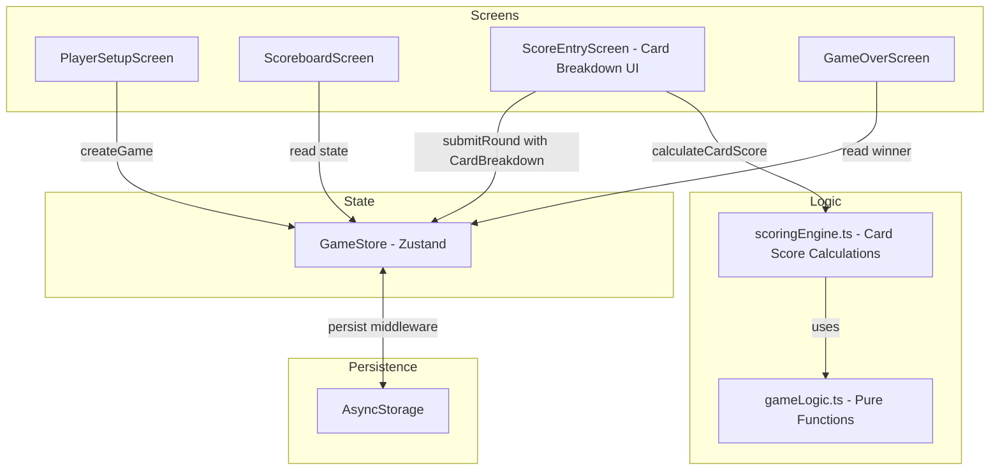
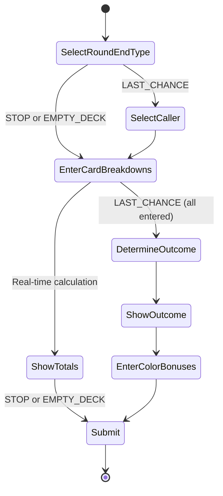

# Design Document: Advanced Score Input

## Overview

Advanced Score Input replaces the current single-number score entry with a category-based card breakdown. Instead of entering a pre-calculated total, users input counts for each card type (Duo, Collector, Multiplier, Mermaid) and the app computes the round score automatically. The feature also implements the full Last Chance flow where the caller's bet outcome determines scoring rules, and adds a Color Bonus input for Last Chance rounds.

### Key Design Decisions

- **Pure scoring engine**: All card-score calculations are pure functions in `gameLogic.ts`, keeping them testable with property-based tests and decoupled from UI/store.
- **Backward-compatible data model**: The existing `Round` and `PlayerRoundScore` types are extended with optional `CardBreakdown` fields. Rounds from older app versions that lack breakdown data are treated as legacy rounds and display only the stored total.
- **Scoring tables as lookup arrays**: Collector scoring tables (Shells, Octopus, Penguins, Sailors) are defined as constant arrays indexed by card count, making them trivially testable and easy to verify against the rulebook.
- **Multi-step Last Chance flow**: The Last Chance round is handled as a multi-step UI flow — card entry → outcome display → color bonus entry — rather than a single form, to keep the user informed of the bet result before entering bonuses.
- **Zustand store unchanged in structure**: The store's `submitRound` action continues to accept `PlayerRoundScore[]`, but the score-entry screen now computes each player's `score` from their `CardBreakdown` before submission. The breakdown is stored alongside the round for auditability.

## Architecture

The architecture extends the existing screen-based pattern. The scoring engine gains new pure functions for card-score calculation, and the data model gains a `CardBreakdown` type.



### Score Entry Flow



## Components and Interfaces

### New Scoring Engine Functions (`src/scoringEngine.ts`)

```typescript
// Scoring table lookups
function getShellPoints(count: number): number;
function getOctopusPoints(count: number): number;
function getPenguinPoints(count: number): number;
function getSailorPoints(count: number): number;

// Category score calculations
function calculateDuoPoints(breakdown: DuoCards): number;
function calculateCollectorPoints(breakdown: CollectorCards): number;
function calculateMultiplierPoints(
    breakdown: MultiplierCards,
    duoCards: DuoCards,
    collectorCards: CollectorCards,
): number;
function calculateMermaidPoints(mermaids: MermaidEntry[]): number;

// Total card score
function calculateCardScore(breakdown: CardBreakdown): number;

// Last Chance resolution
function determineLastChanceOutcome(
    callerCardScore: number,
    opponentCardScores: number[],
): LastChanceOutcome;

function calculateLastChanceRoundScores(
    playerBreakdowns: PlayerCardBreakdown[],
    callerIndex: number,
    colorBonuses: number[],
): PlayerRoundScore[];

// Validation
function validateCardBreakdown(breakdown: CardBreakdown): ValidationResult;
```

### Updated Score Entry Screen

The `ScoreEntryScreen` is refactored from a single numeric input per player to a multi-section card breakdown form. Each player gets expandable sections for Duo, Collector, Multiplier, and Mermaid cards. The calculated `CardScore` is shown in real time.

For Last Chance rounds, the screen adds:

1. A caller selection step before card entry
2. An outcome display after all breakdowns are entered
3. A color bonus input step for each player

### Game Store Changes

The store's `submitRound` signature stays the same (`PlayerRoundScore[]` + `RoundEndType`), but the `Round` type gains optional fields for `CardBreakdown` data and Last Chance metadata. The score-entry screen computes the final `PlayerRoundScore[]` from breakdowns before calling `submitRound`.

```typescript
// Extended submitRound that also stores breakdowns
submitRound: (
    scores: PlayerRoundScore[],
    roundEndType: RoundEndType,
    breakdowns?: PlayerCardBreakdown[],
    lastChanceData?: LastChanceRoundData,
) => RoundResult;
```

## Data Models

### Card Breakdown Types

```typescript
interface DuoCards {
    crabPairs: number; // >= 0
    boatPairs: number; // >= 0
    fishPairs: number; // >= 0
    swimmerSharkCombos: number; // >= 0
}

interface CollectorCards {
    shells: number; // 0-6
    octopus: number; // 0-5
    penguins: number; // 0-3
    sailors: number; // 0-2
}

interface MultiplierCards {
    lighthouses: number; // >= 0
    shoalOfFish: number; // >= 0
    penguinColony: number; // >= 0
    captains: number; // >= 0
}

interface MermaidEntry {
    colorCount: number; // >= 0, the number of cards of the chosen color
}

interface CardBreakdown {
    duoCards: DuoCards;
    collectorCards: CollectorCards;
    multiplierCards: MultiplierCards;
    mermaids: MermaidEntry[]; // 0-4 entries
}

interface PlayerCardBreakdown {
    playerIndex: number;
    breakdown: CardBreakdown;
}
```

### Last Chance Types

```typescript
type LastChanceOutcome = "won" | "lost";

interface LastChanceRoundData {
    callerIndex: number;
    outcome: LastChanceOutcome;
    colorBonuses: number[]; // indexed by playerIndex
}
```

### Extended Round Type

```typescript
interface Round {
    roundNumber: number;
    scores: PlayerRoundScore[];
    roundEndType: RoundEndType;
    // New optional fields for advanced score input
    breakdowns?: PlayerCardBreakdown[];
    lastChanceData?: LastChanceRoundData;
}
```

### Scoring Tables (Constants)

```typescript
const SHELL_POINTS = [0, 0, 2, 4, 6, 8, 10]; // index = card count (0-6)
const OCTOPUS_POINTS = [0, 0, 3, 6, 9, 12]; // index = card count (0-5)
const PENGUIN_POINTS = [0, 1, 3, 5]; // index = card count (0-3)
const SAILOR_POINTS = [0, 0, 5]; // index = card count (0-2)
```

### Multiplier Scoring Rules

| Multiplier Card | Multiplied By               | Points Per Unit |
| --------------- | --------------------------- | --------------- |
| Lighthouse      | Boat pair count × 2 (cards) | 1 per boat card |
| Shoal of Fish   | Fish pair count × 2 (cards) | 1 per fish card |
| Penguin Colony  | Penguin collector count     | 2 per penguin   |
| Captain         | Sailor collector count      | 3 per sailor    |

### Validation Constraints

| Field              | Type    | Min | Max | Notes                    |
| ------------------ | ------- | --- | --- | ------------------------ |
| Duo card counts    | integer | 0   | ∞   | No upper bound           |
| Shells             | integer | 0   | 6   | Per scoring table        |
| Octopus            | integer | 0   | 5   | Per scoring table        |
| Penguins           | integer | 0   | 3   | Per scoring table        |
| Sailors            | integer | 0   | 2   | Per scoring table        |
| Multiplier counts  | integer | 0   | ∞   | No upper bound           |
| Mermaid count      | integer | 0   | 4   | 4 = instant win prompt   |
| Mermaid colorCount | integer | 0   | ∞   | Cards of chosen color    |
| Color Bonus        | integer | 0   | ∞   | Cards of most-held color |

## Correctness Properties

_A property is a characteristic or behavior that should hold true across all valid executions of a system — essentially, a formal statement about what the system should do. Properties serve as the bridge between human-readable specifications and machine-verifiable correctness guarantees._

### Property 1: Duo points equal sum of pair/combo counts

_For any_ valid `DuoCards` object (all fields non-negative integers), `calculateDuoPoints` should return `crabPairs + boatPairs + fishPairs + swimmerSharkCombos`.

**Validates: Requirements 1.6**

### Property 2: Multiplier points follow multiplication rules

_For any_ valid `MultiplierCards`, `DuoCards`, and `CollectorCards` combination, `calculateMultiplierPoints` should return:

- `lighthouses × boatPairs × 2` (1pt per boat card, 2 cards per pair)
- plus `shoalOfFish × fishPairs × 2` (1pt per fish card, 2 cards per pair)
- plus `penguinColony × penguins × 2` (2pt per penguin)
- plus `captains × sailors × 3` (3pt per sailor)

**Validates: Requirements 3.5, 3.6, 3.7, 3.8**

### Property 3: Mermaid points equal sum of color counts

_For any_ list of 0-4 `MermaidEntry` objects with non-negative `colorCount` values, `calculateMermaidPoints` should return the sum of all `colorCount` values.

**Validates: Requirements 4.3, 4.4**

### Property 4: Card score is sum of all category scores

_For any_ valid `CardBreakdown`, `calculateCardScore` should return `calculateDuoPoints(duo) + calculateCollectorPoints(collector) + calculateMultiplierPoints(multiplier, duo, collector) + calculateMermaidPoints(mermaids)`.

**Validates: Requirements 5.1**

### Property 5: Non-Last-Chance round score equals card score

_For any_ set of player `CardBreakdown` objects and a round end type of STOP or EMPTY_DECK, each player's `Round_Score` should equal their `Card_Score`.

**Validates: Requirements 5.3**

### Property 6: Last Chance outcome is won iff caller score >= all opponents

_For any_ caller card score and list of opponent card scores, `determineLastChanceOutcome` should return `"won"` if and only if the caller's score is greater than or equal to every opponent's score, and `"lost"` otherwise.

**Validates: Requirements 6.3, 6.4**

### Property 7: Last Chance round scoring follows outcome rules

_For any_ set of player card scores, a caller index, a Last Chance outcome, and color bonuses:

- If outcome is `"won"`: caller's round score = caller's card score + caller's color bonus, and each opponent's round score = that opponent's color bonus only.
- If outcome is `"lost"`: caller's round score = caller's color bonus only, and each opponent's round score = that opponent's card score.

**Validates: Requirements 6.7, 6.8, 6.10, 6.11**

### Property 8: Card breakdown validation accepts valid inputs and rejects invalid ones

_For any_ `CardBreakdown` object, `validateCardBreakdown` should return valid if and only if: all duo card counts are non-negative integers, shells is 0-6, octopus is 0-5, penguins is 0-3, sailors is 0-2, all multiplier counts are non-negative integers, mermaid count is 0-4, and all mermaid color counts are non-negative integers.

**Validates: Requirements 1.5, 9.1, 9.2, 9.3**

### Property 9: Round with card breakdown serialization round trip

_For any_ valid `Round` object containing `CardBreakdown` data and optional `LastChanceRoundData`, serializing then deserializing should produce an equivalent `Round` object with all breakdown fields, caller index, outcome, and color bonuses preserved.

**Validates: Requirements 7.1, 7.2, 7.3, 8.1, 8.2, 8.3**

## Error Handling

### Input Validation Errors

| Error Condition                        | Handling                                                     |
| -------------------------------------- | ------------------------------------------------------------ |
| Duo card count is negative             | Display validation error, prevent submission                 |
| Duo card count is not an integer       | Input field restricts to integers; parse and floor if needed |
| Collector card count exceeds max       | Display validation error, prevent submission                 |
| Collector card count is negative       | Display validation error, prevent submission                 |
| Mermaid color count is negative        | Display validation error, prevent submission                 |
| Color bonus is negative or non-integer | Display validation error, prevent submission                 |
| Mermaid count exceeds 4                | Input clamped to 0-4 range                                   |

### State Errors

| Error Condition                             | Handling                                           |
| ------------------------------------------- | -------------------------------------------------- |
| Submit round with no game session           | Throw error (existing behavior)                    |
| Last Chance round with no caller selected   | Disable submit until caller is selected            |
| Last Chance round with invalid caller index | Validate caller index is within `[0, playerCount)` |

### Backward Compatibility

| Condition                                   | Handling                                                                  |
| ------------------------------------------- | ------------------------------------------------------------------------- |
| Legacy round without `breakdowns` field     | Display stored total score; breakdown section shows "Legacy round"        |
| Legacy round without `lastChanceData` field | Treat as non-Last-Chance round for display purposes                       |
| New round with breakdowns loaded in old app | Old app ignores unknown fields (JSON serialization is forward-compatible) |

## Testing Strategy

### Testing Framework

- **Unit & Integration Tests**: Jest (ships with Expo)
- **Property-Based Tests**: [fast-check](https://github.com/dubzzz/fast-check) — already used in the project
- **Component Tests**: React Native Testing Library (for screen-level tests)

### Dual Testing Approach

Both unit tests and property-based tests are required.

**Unit tests** focus on:

- Collector scoring table lookups (all entries for Shells, Octopus, Penguins, Sailors — Requirements 2.5-2.8)
- Specific Last Chance scenarios (caller wins/loses with known values)
- Edge cases: all-zero breakdown, legacy round without breakdowns, mermaid count of 4 triggering instant win prompt
- UI input field presence and default values (Requirements 1.1-1.4, 2.1-2.4, 3.1-3.4, 4.1, 9.5)

**Property-based tests** focus on:

- Universal computation rules (duo, multiplier, mermaid, card score)
- Last Chance outcome determination and scoring
- Validation logic across all valid and invalid inputs
- Serialization round trip for breakdowns and Last Chance data
- Each property test maps to a Correctness Property from this design document
- Minimum 100 iterations per property test
- Each test is tagged with a comment referencing the design property

### Property Test Tagging

Each property-based test must include a comment in this format:

```typescript
// Feature: advanced-score-input, Property 1: Duo points equal sum of pair/combo counts
```

### Test Organization

```
__tests__/
  scoringEngine.test.ts           # Unit tests for scoring table lookups, specific scenarios
  scoringEngine.property.test.ts  # Property-based tests for scoring engine (P1-P8)
  persistence.test.ts             # Extended with round-trip test for breakdowns (P9)
```

### Property-to-Test Mapping

| Property                                 | Test Type             | Test File                        |
| ---------------------------------------- | --------------------- | -------------------------------- |
| P1: Duo points = sum of counts           | Property (fast-check) | `scoringEngine.property.test.ts` |
| P2: Multiplier points follow rules       | Property (fast-check) | `scoringEngine.property.test.ts` |
| P3: Mermaid points = sum of color counts | Property (fast-check) | `scoringEngine.property.test.ts` |
| P4: Card score = sum of categories       | Property (fast-check) | `scoringEngine.property.test.ts` |
| P5: Non-LC round score = card score      | Property (fast-check) | `scoringEngine.property.test.ts` |
| P6: Last Chance outcome determination    | Property (fast-check) | `scoringEngine.property.test.ts` |
| P7: Last Chance round scoring            | Property (fast-check) | `scoringEngine.property.test.ts` |
| P8: Card breakdown validation            | Property (fast-check) | `scoringEngine.property.test.ts` |
| P9: Round serialization round trip       | Property (fast-check) | `persistence.test.ts`            |

### Custom Generators (fast-check Arbitraries)

Key generators needed for property tests:

```typescript
// Card breakdown generators
const arbDuoCards = fc.record({
    crabPairs: fc.nat({ max: 10 }),
    boatPairs: fc.nat({ max: 10 }),
    fishPairs: fc.nat({ max: 10 }),
    swimmerSharkCombos: fc.nat({ max: 10 }),
});

const arbCollectorCards = fc.record({
    shells: fc.integer({ min: 0, max: 6 }),
    octopus: fc.integer({ min: 0, max: 5 }),
    penguins: fc.integer({ min: 0, max: 3 }),
    sailors: fc.integer({ min: 0, max: 2 }),
});

const arbMultiplierCards = fc.record({
    lighthouses: fc.nat({ max: 5 }),
    shoalOfFish: fc.nat({ max: 5 }),
    penguinColony: fc.nat({ max: 5 }),
    captains: fc.nat({ max: 5 }),
});

const arbMermaidEntry = fc.record({
    colorCount: fc.nat({ max: 20 }),
});

const arbMermaids = fc
    .integer({ min: 0, max: 4 })
    .chain((count) =>
        fc.array(arbMermaidEntry, { minLength: count, maxLength: count }),
    );

const arbCardBreakdown = fc.record({
    duoCards: arbDuoCards,
    collectorCards: arbCollectorCards,
    multiplierCards: arbMultiplierCards,
    mermaids: arbMermaids,
});

// Last Chance generators
const arbLastChanceOutcome = fc.constantFrom("won" as const, "lost" as const);
const arbColorBonus = fc.nat({ max: 20 });
```

### fast-check Configuration

```typescript
const FC_SETTINGS = { numRuns: 100 };
```
