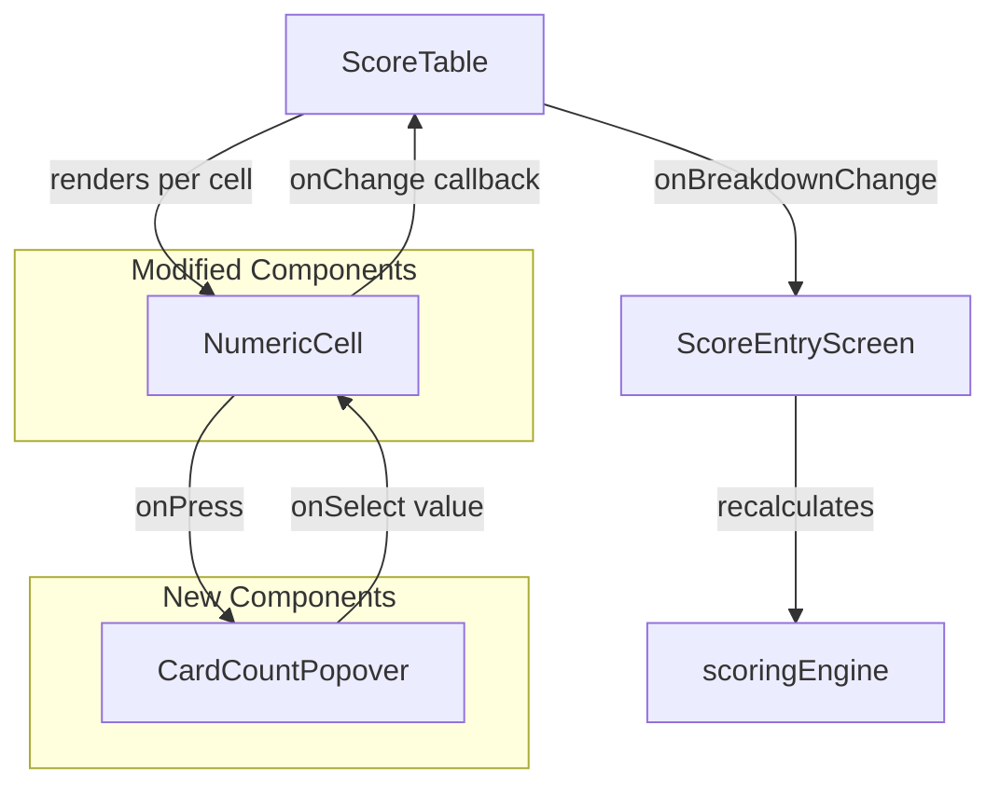
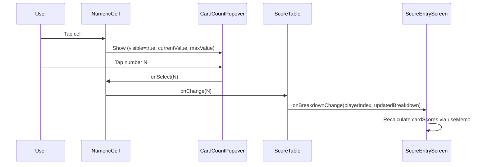

# Design Document: Card Count Popover

## Overview

Replace the `TextInput`-based `NumericCell` component in the score-entry screen with a tap-to-select popover. When a user taps a card count cell, a `Modal`-based popover appears showing a grid of numbers from 0 to the card type's deck maximum. Tapping a number sets the value and closes the popover. This eliminates keyboard input for card counts, prevents out-of-range values by construction, and works consistently across iOS, Android, and web.

The change is scoped to:

1. A new `CardCountPopover` component (the modal grid picker)
2. Refactoring `NumericCell` from a `TextInput` to a pressable read-only display that opens the popover
3. A `DECK_MAX` constant map that defines the valid range per card type
4. No changes to types, scoring engine, game logic, or store

## Architecture



The architecture is minimal: `NumericCell` gains a `maxValue` prop and manages popover visibility state internally. `CardCountPopover` is a pure presentational component that receives `currentValue`, `maxValue`, `onSelect`, and `onClose`.

### Popover Positioning Strategy

The popover uses React Native's `Modal` with `transparent` background and a full-screen `TouchableOpacity` backdrop for dismiss-on-tap-outside. The grid content is centered on screen (not anchored to the cell) to keep the implementation simple and avoid cross-platform measurement issues. This is acceptable because the grid is small and the context (which cell is being edited) is clear from the highlighted current value.

## Components and Interfaces

### DECK_MAX Constant Map

A new exported constant defining the maximum count for each card type field. This is the single source of truth for popover ranges.

```typescript
// src/deckLimits.ts
export const DECK_MAX: Record<string, number> = {
    crabs: 9,
    boats: 8,
    fish: 7,
    swimmerSharkCombos: 10,
    shells: 6,
    octopus: 5,
    penguins: 3,
    sailors: 2,
    mermaidCount: 4,
    mermaidColorCount: 9,
};
```

### CardCountPopover Component

```typescript
interface CardCountPopoverProps {
    visible: boolean;
    currentValue: number;
    maxValue: number;
    onSelect: (value: number) => void;
    onClose: () => void;
    accessibilityLabel: string;
}
```

Renders a `Modal` containing:

- A full-screen transparent `TouchableOpacity` backdrop (calls `onClose` on press)
- A centered white card with a grid of number buttons (0 to `maxValue`)
- The button matching `currentValue` is visually highlighted (distinct background color)
- Each button has `accessibilityRole="button"` and `accessibilityLabel={`Select ${n}`}`

Grid layout: uses `flexWrap: 'wrap'` with fixed-width items, 5 columns. For `maxValue` up to 10, this produces at most 3 rows — compact enough for any screen.

### NumericCell Component (Modified)

```typescript
interface NumericCellProps {
    value: number;
    maxValue: number; // NEW — deck max for this card type
    onChange: (value: number) => void;
    accessibilityLabel: string;
}
```

Changes:

- Remove `TextInput`, replace with `TouchableOpacity` wrapping a `Text` displaying the current value
- Internal `popoverVisible` state (boolean)
- On press → set `popoverVisible = true`
- Renders `CardCountPopover` with `visible={popoverVisible}`
- On select → call `onChange(selectedValue)`, set `popoverVisible = false`
- On close → set `popoverVisible = false`
- The displayed text is read-only; no keyboard ever appears

### ScoreTable Changes

`ScoreTable` and its helper `renderCardRowPlayerCells` must pass the correct `maxValue` to each `NumericCell`. This means:

- Each call site that renders a `NumericCell` for a card type passes the corresponding `DECK_MAX[cardType]` value
- The `renderCardRowPlayerCells` helper gains an optional `maxValue` parameter
- Mermaid count cells use `DECK_MAX.mermaidCount` (4)
- Mermaid color count cells use `DECK_MAX.mermaidColorCount` (9)

## Data Models

No new data models are introduced. The existing `CardBreakdown`, `DuoCards`, `CollectorCards`, and `MermaidEntry` types remain unchanged. The popover is purely a UI-layer change — it writes the same `number` values into the same breakdown fields.

The only new data structure is the `DECK_MAX` constant map (see Components section), which is a simple `Record<string, number>` and not a runtime data model.

### Data Flow



## Correctness Properties

_A property is a characteristic or behavior that should hold true across all valid executions of a system — essentially, a formal statement about what the system should do. Properties serve as the bridge between human-readable specifications and machine-verifiable correctness guarantees._

### Property 1: Popover renders exactly 0..maxValue buttons

_For any_ `maxValue` in [0, 10], the `CardCountPopover` component rendered with that `maxValue` shall produce exactly `maxValue + 1` selectable number buttons, with values 0, 1, 2, ..., `maxValue` in order.

**Validates: Requirements 1.2, 2.1, 2.2, 2.3, 2.4, 2.5, 2.6, 2.7, 2.8, 2.9, 2.10**

### Property 2: Selecting a number calls onSelect with that number

_For any_ `maxValue` in [0, 10] and _for any_ `n` in [0, `maxValue`], pressing the button labeled `n` in the `CardCountPopover` shall invoke `onSelect` with the value `n`.

**Validates: Requirements 1.3, 5.3**

### Property 3: Exactly one button is highlighted matching currentValue

_For any_ `maxValue` in [0, 10] and _for any_ `currentValue` in [0, `maxValue`], the `CardCountPopover` shall render exactly one button with the highlighted style, and that button's value shall equal `currentValue`.

**Validates: Requirements 3.1**

### Property 4: Closed NumericCell displays value as read-only text

_For any_ integer `value` in [0, 10], a `NumericCell` with the popover closed shall render a `Text` element displaying `String(value)` and shall not render a `TextInput`.

**Validates: Requirements 5.1, 5.2**

### Property 5: All popover buttons have correct accessibility attributes

_For any_ `maxValue` in [0, 10], every selectable button in the `CardCountPopover` shall have `accessibilityRole="button"` and an `accessibilityLabel` containing the number it represents.

**Validates: Requirements 6.1**

## Error Handling

Since the popover constrains input to valid values by construction (0 to `maxValue`), most error conditions from free-text input are eliminated:

- **Out-of-range values**: Impossible — the popover only offers valid numbers
- **Non-numeric input**: Impossible — there is no text input
- **Negative values**: Impossible — 0 is the minimum selectable value

Remaining error handling:

- **Invalid `maxValue` prop**: If `maxValue` is negative or non-integer, `CardCountPopover` renders no buttons. This is a programming error, not a user error.
- **Popover dismiss**: Tapping outside always closes without side effects. No error state needed.
- **Existing validation**: The `validateCardBreakdown` function in `scoringEngine.ts` remains as a safety net. It will continue to validate breakdowns on submit, catching any edge cases.

## Testing Strategy

### Property-Based Tests

Use `fast-check` (already in devDependencies) for property-based testing. Each property test runs a minimum of 100 iterations.

Tests will be in `__tests__/cardCountPopover.property.test.ts` (or `.tsx` if rendering is needed).

Since `CardCountPopover` is a React Native component, property tests will focus on the pure logic aspects:

- Generate random `maxValue` values and verify the generated number array (0..maxValue) has the correct length and contents
- Generate random `(maxValue, selectedIndex)` pairs and verify callback behavior
- Generate random `(maxValue, currentValue)` pairs and verify highlight logic

For properties that require rendering (Properties 4, 5), use `@testing-library/react-native` if available, or test the underlying logic functions.

Each test must be tagged with a comment:

```
// Feature: card-count-popover, Property 1: Popover renders exactly 0..maxValue buttons
```

### Unit Tests

Unit tests in `__tests__/cardCountPopover.test.ts`:

- **DECK_MAX mapping**: Verify each card type maps to the correct max value (crabs→9, boats→8, fish→7, swimmerSharkCombos→10, shells→6, octopus→5, penguins→3, sailors→2, mermaidCount→4, mermaidColorCount→9). Covers Requirements 2.1–2.10 as specific examples.
- **Tap outside dismisses**: Verify `onClose` is called when backdrop is pressed. Covers Requirement 1.4.
- **NumericCell opens popover on press**: Verify pressing the cell shows the popover. Covers Requirement 1.1.
- **Accessibility label passthrough**: Verify `NumericCell` passes its `accessibilityLabel` to the pressable element. Covers Requirement 6.2.

### What Is NOT Tested

- Cross-platform rendering (Requirements 4.1, 4.2, 4.3) — requires device/browser testing
- Grid layout fitting within screen bounds (Requirement 3.2) — visual/layout concern
- Score recalculation integration — already covered by existing `scoringEngine` tests
