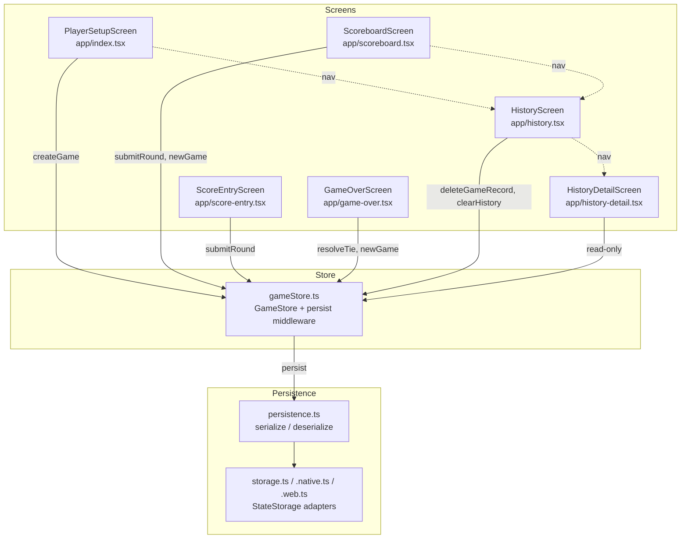

# Design Document: Game Persistence

## Overview

This feature adds a game history layer to the Sea Salt & Paper Scorer app. Currently, the Zustand store (`gameStore.ts`) persists only the active `GameSession` via `zustand/middleware`'s `persist`. When a new game starts, the previous session is discarded.

The design introduces:

- A `GameRecord` type wrapping a `GameSession` with metadata (id, timestamps, status).
- A `gameHistory` array in the Zustand store, co-persisted alongside the active session.
- Automatic archival of completed and abandoned games into history.
- A History screen listing past games, with navigation to a read-only scoreboard detail view.
- Delete single / clear all history operations with confirmation prompts.
- Extended serialization/deserialization in `persistence.ts` for the history array.

The existing `persist` middleware and platform-specific `StateStorage` adapters (AsyncStorage on native, localStorage on web, in-memory for tests) are reused — no new storage layer is needed.

## Architecture

The feature extends the existing architecture rather than introducing new layers.



Key decisions:

1. History lives in the same Zustand store and same persist key. This keeps the persistence story simple — one `createJSONStorage` call handles both active game and history.
2. New screens (`history.tsx`, `history-detail.tsx`) are added as Expo Router file-based routes.
3. The read-only detail view reuses the existing scoreboard rendering logic (column layout, round-end icons) but strips action buttons.
4. `GameRecord` IDs use a simple timestamp + random suffix (`Date.now()-Math.random().toString(36).slice(2,8)`) — no UUID library needed.

## Components and Interfaces

### New Types (`src/types.ts`)

```typescript
export type GameStatus = "completed" | "abandoned";

export interface GameRecord {
    id: string;
    session: GameSession;
    status: GameStatus;
    createdAt: string; // ISO 8601
    completedAt: string; // ISO 8601
}
```

### Extended Store Interface (`src/store/gameStore.ts`)

```typescript
export interface GameStore {
  // Existing
  gameSession: GameSession | null;
  createGame: (players: PlayerInput[]) => void;
  submitRound: (...) => RoundResult;
  declareMermaidWin: (playerIndex: number) => void;
  resolveTie: (lastRoundPlayerIndex: number) => void;
  newGame: () => void;

  // New
  gameHistory: GameRecord[];
  archiveGame: (status: GameStatus) => void;
  deleteGameRecord: (id: string) => void;
  clearHistory: () => void;
}
```

- `archiveGame(status)`: Snapshots the current `gameSession` into a `GameRecord`, appends to `gameHistory`, and (if called from `newGame`) clears the active session.
- `deleteGameRecord(id)`: Removes a single record by id.
- `clearHistory()`: Empties the `gameHistory` array.

### Modified Actions

- `newGame()`: Before clearing `gameSession`, checks if an active game exists with at least one round. If so, calls `archiveGame("abandoned")`.
- `submitRound()` / `declareMermaidWin()` / `resolveTie()`: After setting a winner, calls `archiveGame("completed")`.

### Extended Persistence (`src/persistence.ts`)

```typescript
export function serializeGameHistory(history: GameRecord[]): string;
export function deserializeGameHistory(json: string): GameRecord[];
```

`deserializeGameHistory` returns `[]` on failure and logs a warning via `console.warn`.

### New Screens

| Screen                | Route                           | Purpose                                                                                 |
| --------------------- | ------------------------------- | --------------------------------------------------------------------------------------- |
| `HistoryScreen`       | `/history`                      | Lists `GameRecord[]` sorted by `completedAt` desc. Empty state message when no records. |
| `HistoryDetailScreen` | `/history-detail?id=<recordId>` | Read-only scoreboard for a selected `GameRecord`.                                       |

### Navigation Additions

- Player setup screen (`index.tsx`): Add a "Game History" button.
- Scoreboard screen (`scoreboard.tsx`): Add a "History" button.
- History screen: Each row navigates to `/history-detail?id=<id>`.
- History detail screen: Back button returns to history list.

### New Components

- `ConfirmClearHistoryDialog`: Reuses the pattern from `ConfirmNewGameDialog` — a modal with cancel/confirm actions.
- `ConfirmDeleteGameDialog`: Same pattern, for single-record deletion.
- `GameHistoryItem`: A list row component showing player names, winner/abandoned badge, final scores, and date.

## Data Models

### GameRecord

| Field         | Type                         | Description                                        |
| ------------- | ---------------------------- | -------------------------------------------------- |
| `id`          | `string`                     | Unique identifier: `${Date.now()}-${randomSuffix}` |
| `session`     | `GameSession`                | Full snapshot of the game at time of archival      |
| `status`      | `"completed" \| "abandoned"` | How the game ended                                 |
| `createdAt`   | `string` (ISO 8601)          | When the game was first created                    |
| `completedAt` | `string` (ISO 8601)          | When the game was archived (win or abandon)        |

### Zustand Persisted State Shape

```typescript
{
  state: {
    gameSession: GameSession | null,
    gameHistory: GameRecord[]
  },
  version: 0
}
```

This is stored under the key `"game-session-storage"` (existing key, extended shape). The `persist` middleware's `partialize` option is not needed — the entire state (minus functions) is persisted by default, which is the current behavior.

### Migration Strategy

Existing users have persisted state with only `gameSession`. When the app hydrates with the new code:

- `gameHistory` will be `undefined` in the persisted JSON.
- The store initializer sets `gameHistory: []` as the default.
- Zustand's `persist` middleware merges persisted state over defaults, so `gameHistory` gracefully defaults to `[]` for existing users.
- No explicit migration or version bump is required.

## Correctness Properties

_A property is a characteristic or behavior that should hold true across all valid executions of a system — essentially, a formal statement about what the system should do. Properties serve as the bridge between human-readable specifications and machine-verifiable correctness guarantees._

### Property 1: Archiving a game appends a correctly-statused record

_For any_ active `GameSession` with at least one round, archiving it with a given status ("completed" or "abandoned") should append exactly one new `GameRecord` to the `gameHistory` array, and that record's `status` field should equal the provided status.

**Validates: Requirements 1.1, 2.1**

### Property 2: GameRecord structural invariants

_For any_ `GameRecord` in the history, it must have a non-empty `id`, a valid `session` (with players and rounds), a valid ISO 8601 `createdAt` timestamp, and a valid ISO 8601 `completedAt` timestamp. Additionally, if the record's status is `"abandoned"`, then `session.winner` must be `null`.

**Validates: Requirements 1.2, 2.2**

### Property 3: History is ordered by completion timestamp descending

_For any_ `gameHistory` array with two or more records, the records should be ordered such that for every consecutive pair, the earlier record's `completedAt` is greater than or equal to the later record's `completedAt` (most recent first).

**Validates: Requirements 4.1**

### Property 4: History item display contains required information

_For any_ `GameRecord`, the rendered history item string/view should contain all player names from the session, the winner name (or "Abandoned" for abandoned games), the final scores, and the game date.

**Validates: Requirements 4.2**

### Property 5: Read-only scoreboard data equivalence

_For any_ `GameRecord`, calling `buildScoreboardRows` on its `session` should produce the same rows (player names, per-round scores, running totals) as calling it on an identical active `GameSession`.

**Validates: Requirements 5.2**

### Property 6: Deleting a record removes exactly that record

_For any_ `gameHistory` array and any record `id` present in it, calling `deleteGameRecord(id)` should result in a history whose length is one less, that no longer contains a record with that `id`, and that still contains all other records unchanged.

**Validates: Requirements 6.2**

### Property 7: Clearing history produces an empty array

_For any_ non-empty `gameHistory` array, calling `clearHistory()` should result in an empty `gameHistory` array.

**Validates: Requirements 7.2**

### Property 8: Game history serialization round-trip

_For any_ valid `GameRecord[]` array, serializing it with `serializeGameHistory` and then deserializing the result with `deserializeGameHistory` should produce an array deeply equal to the original.

**Validates: Requirements 8.1, 8.2, 8.3**

## Error Handling

| Scenario                                       | Handling                                                                                                                 |
| ---------------------------------------------- | ------------------------------------------------------------------------------------------------------------------------ |
| Corrupted persisted `gameHistory` JSON         | `deserializeGameHistory` returns `[]` and logs `console.warn`. The app starts with empty history.                        |
| Corrupted persisted `gameSession` JSON         | Existing behavior: `_layout.tsx` catches the error, calls `newGame()`, user sees setup screen.                           |
| `archiveGame` called with no active session    | No-op (guard: `if (!gameSession) return`).                                                                               |
| `deleteGameRecord` called with non-existent id | No-op (filter produces same array).                                                                                      |
| Storage adapter write failure                  | Zustand's persist middleware handles this internally. On native, AsyncStorage errors are swallowed by the middleware.    |
| History grows very large                       | No explicit limit in this iteration. Future enhancement: add a configurable max history size with oldest-first eviction. |

## Testing Strategy

### Unit Tests

Unit tests cover specific examples, edge cases, and UI integration points:

- Archiving a completed 2-player game produces a record with correct fields (example for Properties 1, 2).
- Archiving an abandoned game sets `winner: null` and `status: "abandoned"` (example for Property 2).
- `deserializeGameHistory` with corrupted JSON returns `[]` (edge case for Req 8.4).
- `deserializeGameHistory` with empty string returns `[]` (edge case for Req 8.4).
- History screen shows empty state message when `gameHistory` is `[]` (example for Req 4.3).
- History detail screen does not render "Add Round" or "New Game" buttons (example for Req 5.3).
- Navigation to history exists from both setup and scoreboard screens (example for Req 4.4).
- Cancelling delete leaves history unchanged (example for Req 6.3).
- Cancelling clear leaves history unchanged (example for Req 7.3).
- App launch with persisted active game navigates to scoreboard (example for Req 3.2).
- App launch with no persisted game shows setup screen (example for Req 3.3).

### Property-Based Tests

Property-based tests use `fast-check` (already a dev dependency) with a minimum of 100 iterations per property. Each test references its design property.

| Property                           | Test Tag                                                                                       | Generator Strategy                                                                         |
| ---------------------------------- | ---------------------------------------------------------------------------------------------- | ------------------------------------------------------------------------------------------ |
| P1: Archive appends correct status | `Feature: game-persistence, Property 1: Archiving a game appends a correctly-statused record`  | Generate random `GameSession` with 1-5 rounds, random status.                              |
| P2: Record structural invariants   | `Feature: game-persistence, Property 2: GameRecord structural invariants`                      | Generate random `GameRecord` via archival, check fields.                                   |
| P3: History ordering               | `Feature: game-persistence, Property 3: History is ordered by completion timestamp descending` | Generate random array of `GameRecord` with varying timestamps, verify sort.                |
| P4: History item display info      | `Feature: game-persistence, Property 4: History item display contains required information`    | Generate random `GameRecord`, render, check all required strings present.                  |
| P5: Read-only data equivalence     | `Feature: game-persistence, Property 5: Read-only scoreboard data equivalence`                 | Generate random `GameSession`, wrap in `GameRecord`, compare `buildScoreboardRows` output. |
| P6: Delete removes exactly one     | `Feature: game-persistence, Property 6: Deleting a record removes exactly that record`         | Generate random history of 1-10 records, pick random id, delete, verify.                   |
| P7: Clear produces empty           | `Feature: game-persistence, Property 7: Clearing history produces an empty array`              | Generate random non-empty history, clear, verify empty.                                    |
| P8: Serialization round-trip       | `Feature: game-persistence, Property 8: Game history serialization round-trip`                 | Generate random `GameRecord[]`, serialize then deserialize, deep equal.                    |

Each property-based test must be implemented as a single `fc.assert(fc.property(...))` call with `{ numRuns: 100 }`.
