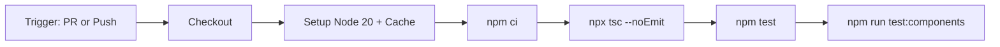

# Design Document: GitHub CI & Documentation

## Overview

This feature adds two deliverables to the Sea Salt & Paper Scorer project:

1. A GitHub Actions CI workflow (`.github/workflows/ci.yml`) that runs type-checking, unit tests, and component tests on every PR and push to `main`.
2. Project documentation: a root `README.md` and a `CONTRIBUTING.md` guide.

No application code changes are required. All artifacts are static configuration and markdown files.

## Architecture

The CI pipeline is a single GitHub Actions workflow file triggered by two events:

- `pull_request` targeting `main` (opened + synchronized)
- `push` to `main`

The workflow runs a single job on an Ubuntu runner with Node.js 20, executing four sequential steps after checkout and dependency installation.



Documentation files live at the repository root:

```
/
├── .github/
│   └── workflows/
│       └── ci.yml          ← CI workflow
├── README.md                ← Project documentation
├── CONTRIBUTING.md          ← Contribution guide
└── ...existing files
```

## Components and Interfaces

### CI Workflow (`.github/workflows/ci.yml`)

A single YAML file defining one job with named steps:

| Step            | Command                                                         | Purpose                               |
| --------------- | --------------------------------------------------------------- | ------------------------------------- |
| Checkout        | `actions/checkout@v4`                                           | Clone the repo                        |
| Setup Node      | `actions/setup-node@v4` with `node-version: 20`, `cache: 'npm'` | Install Node.js, cache `node_modules` |
| Install         | `npm ci`                                                        | Deterministic dependency install      |
| Type Check      | `npx tsc --noEmit`                                              | Validate TypeScript types             |
| Unit Tests      | `npm test`                                                      | Run Jest unit + property tests        |
| Component Tests | `npm run test:components`                                       | Run Jest component tests              |

The workflow uses GitHub's built-in status reporting — each step's pass/fail is reflected on the PR automatically.

### README.md

Sections:

- Project name and description
- Tech stack (Expo SDK 54, React Native 0.81.5, React 19.1, TypeScript 5.8, Zustand)
- Prerequisites (Node.js ≥ 20, npm, Expo CLI)
- Getting started (clone, `npm install`, `npx expo start`)
- Available scripts table (`start`, `test`, `test:components`, `test:e2e`)
- Project structure overview (app/, src/, e2e/, assets/)
- Testing section covering unit, component, and e2e tests

### CONTRIBUTING.md

Sections:

- Fork-and-branch workflow description
- Local setup steps
- Requirement that all tests pass before submitting a PR
- Expected PR format (descriptive title, summary of changes)
- Reference to CI pipeline as a required check

## Data Models

No data models are introduced. All artifacts are static files (YAML workflow config and Markdown documentation).

## Correctness Properties

_A property is a characteristic or behavior that should hold true across all valid executions of a system — essentially, a formal statement about what the system should do. Properties serve as the bridge between human-readable specifications and machine-verifiable correctness guarantees._

### Property 1: CI workflow contains all required check steps

_For any_ valid CI workflow file, parsing its YAML content must reveal distinct named steps for: dependency installation (`npm ci`), type checking (`tsc --noEmit`), unit tests (`npm test`), and component tests (`npm run test:components`).

**Validates: Requirements 1.1, 1.2, 1.3, 2.1, 2.2, 2.3, 6.3**

### Property 2: CI workflow triggers on both PR and push to main

_For any_ valid CI workflow file, parsing its YAML content must show that it is triggered by both `pull_request` events targeting the `main` branch and `push` events to the `main` branch.

**Validates: Requirements 1.1, 1.4, 2.1**

### Property 3: README documents all required technologies and scripts

_For any_ technology in the set {Expo, React Native, TypeScript, Zustand} and _for any_ script in the set {start, test, test:components, test:e2e}, the README must contain a mention of that item.

**Validates: Requirements 4.2, 4.5**

## Error Handling

This feature introduces no runtime code, so traditional error handling does not apply. However, the following failure modes exist:

- **CI step failure**: If any step (type-check, unit tests, component tests) exits with a non-zero code, GitHub Actions marks the job as failed and reports the status on the PR. No custom error handling is needed — this is built-in behavior.
- **Dependency install failure**: If `npm ci` fails (e.g., lockfile mismatch), the job fails early before any test steps run. The developer sees the error in the Actions log.
- **YAML syntax errors**: If `ci.yml` has invalid YAML, GitHub rejects the workflow and shows a parse error in the Actions tab. This is caught at push time.

## Testing Strategy

### Unit Tests (Example-Based)

Since this feature produces static files (YAML + Markdown), unit tests validate the content of those files:

- **CI workflow structure**: Parse `ci.yml` and verify it contains the expected triggers, runner, Node version, cache config, and step commands (covers Requirements 3.1–3.4, 6.1–6.3).
- **README content**: Verify the README contains required sections — project name, prerequisites, setup instructions, directory structure, and test commands (covers Requirements 4.1, 4.3, 4.4, 4.6, 4.7).
- **CONTRIBUTING content**: Verify the contributing guide mentions fork-and-branch workflow, local setup, test requirements, PR format, and CI reference (covers Requirements 5.1–5.5).

### Property-Based Tests (fast-check)

Property-based tests use `fast-check` (already in devDependencies) to validate universal properties:

- **Property 1 test**: Generate sets of "required step" descriptors and verify the parsed workflow YAML contains a matching named step for each. Minimum 100 iterations.
    - Tag: `Feature: github-ci-docs, Property 1: CI workflow contains all required check steps`
- **Property 2 test**: Verify the parsed workflow triggers include both `pull_request` (branches: main) and `push` (branches: main). Minimum 100 iterations.
    - Tag: `Feature: github-ci-docs, Property 2: CI workflow triggers on both PR and push to main`
- **Property 3 test**: Generate random subsets of the required technologies and scripts lists, and verify each item appears in the README content. Minimum 100 iterations.
    - Tag: `Feature: github-ci-docs, Property 3: README documents all required technologies and scripts`

Each property-based test must reference its design document property number and be implemented as a single `fc.assert(fc.property(...))` call with `{ numRuns: 100 }`.

### E2E Tests

No e2e tests are needed. The CI workflow is validated by GitHub Actions itself when it runs. The documentation files are static markdown with no runtime behavior.
