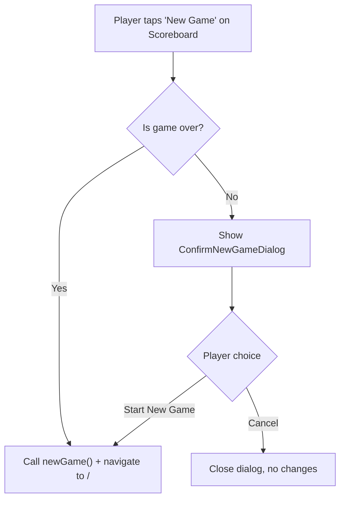

# Design Document: New Game Warning

## Overview

This feature adds a confirmation warning dialog to the Scoreboard screen when a player taps "New Game" while a game is still in progress (no winner declared). The dialog prevents accidental loss of game progress by requiring explicit confirmation before resetting. When the game is already over (winner exists), or when "New Game" is tapped from the Game Over screen, no warning is shown.

The implementation is minimal: a single new `ConfirmNewGameDialog` component using React Native's `Modal`, integrated into `scoreboard.tsx` via a boolean visibility state. The existing `handleNewGame` function is modified to check `isGameOver` and conditionally show the dialog instead of immediately resetting.

## Architecture

The feature is entirely client-side and touches only the presentation layer. No changes to the game store, game logic, or navigation structure are needed.



### Key Design Decision

We use React Native's built-in `Modal` component (consistent with `RoundSummaryModal`) rather than `Alert.alert()`. This gives us full control over styling, accessibility labels, and cross-platform consistency with the app's origami/paper theme.

## Components and Interfaces

### ConfirmNewGameDialog

A new presentational component at `src/components/ConfirmNewGameDialog.tsx`.

```typescript
interface ConfirmNewGameDialogProps {
    visible: boolean;
    onCancel: () => void;
    onConfirm: () => void;
}
```

- `visible`: Controls modal visibility
- `onCancel`: Called when "Cancel" is pressed — closes the dialog
- `onConfirm`: Called when "Start New Game" is pressed — triggers game reset + navigation

The component renders:

- A semi-transparent overlay (tap to dismiss = cancel)
- A themed card with title, message body, and two action buttons
- "Cancel" button (outline variant) and "Start New Game" button (primary variant, using `colors.error` or `colors.accent` to signal destructive action)
- Accessibility labels on both buttons and the close overlay

### Scoreboard Integration (scoreboard.tsx)

Changes to `ScoreboardScreen`:

1. Add `const [showNewGameWarning, setShowNewGameWarning] = useState(false)` state
2. Modify `handleNewGame`:
    - If `isGameOver` is `true`: call `newGame()` and navigate directly (current behavior)
    - If `isGameOver` is `false`: call `setShowNewGameWarning(true)`
3. Add a `handleConfirmNewGame` callback that calls `newGame()`, navigates to `/`, and closes the dialog
4. Render `<ConfirmNewGameDialog>` with the state and callbacks

### Game Over Screen (game-over.tsx)

No changes needed. The Game Over screen already calls `newGame()` directly, and per requirements, no warning should appear here.

## Data Models

No new data models or store changes are required. The feature uses only local component state (`useState<boolean>`) to track dialog visibility.

Existing types referenced:

- `GameSession.winner: WinResult | null` — used to determine if game is in progress (`winner === null` and players exist)
- The `isGameOver` derived boolean already computed in `scoreboard.tsx` as `session.winner !== null`

## Correctness Properties

_A property is a characteristic or behavior that should hold true across all valid executions of a system — essentially, a formal statement about what the system should do. Properties serve as the bridge between human-readable specifications and machine-verifiable correctness guarantees._

### Property 1: Dialog visibility matches game-in-progress state

_For any_ game session, when the player presses "New Game" on the Scoreboard, the warning dialog should be shown if and only if the game is in progress (winner is null and at least one player exists). If the game is over (winner is not null), the dialog should not be shown and `newGame()` should be called immediately.

**Validates: Requirements 1.1, 1.2**

### Property 2: Cancel preserves game state

_For any_ game session where the warning dialog is visible, pressing "Cancel" should close the dialog and leave the game session completely unchanged (same players, same rounds, same winner status).

**Validates: Requirements 2.3, 3.1**

### Property 3: Confirm triggers game reset

_For any_ game session where the warning dialog is visible, pressing "Start New Game" should invoke the `onConfirm` callback, which resets the game session (calls `newGame()`) and navigates to the player setup screen.

**Validates: Requirements 2.4, 3.2**

## Error Handling

This feature has a narrow scope with minimal error surface:

- **No game session**: If `session` is `null` when the scoreboard renders, the existing redirect to `/` fires before any dialog logic runs. No additional handling needed.
- **Dialog state leak**: The `showNewGameWarning` state is local to `ScoreboardScreen`. If the user navigates away (e.g., to score-entry) and back, React re-mounts the component with `showNewGameWarning = false`, so no stale dialog can appear.
- **Rapid double-tap**: If the user taps "Start New Game" in the dialog twice quickly, `newGame()` is idempotent (sets `gameSession` to `null`), and `router.replace("/")` is also safe to call multiple times. No guard needed.

## Testing Strategy

### Unit Tests (jest + @testing-library/react-native)

Run via `npm run test:components` (uses `jest.config.components.js` with `jest-expo` preset).

Unit tests cover specific examples, static content, accessibility, and edge cases:

1. **Dialog content**: Verify the dialog renders a title indicating the game is not finished and a message about discarding progress (Requirements 2.1, 2.2)
2. **Accessibility labels**: Verify both "Cancel" and "Start New Game" buttons have `accessibilityLabel` props (Requirement 3.3)
3. **Dialog not rendered when hidden**: Verify `visible={false}` renders no meaningful content
4. **Game Over screen has no dialog**: Verify `game-over.tsx` does not render `ConfirmNewGameDialog` (Requirement 4.1)
5. **Overlay dismiss**: Verify pressing the overlay backdrop calls `onCancel`

### Property-Based Tests (jest + fast-check)

Run via `npm run test` (uses `jest.config.js` with `ts-jest` preset).

Each property test runs a minimum of 100 iterations with randomly generated game sessions.

Property tests validate the three correctness properties:

1. **Feature: new-game-warning, Property 1: Dialog visibility matches game-in-progress state** — Generate random `GameSession` objects (with and without winners), apply the `shouldShowWarning` decision logic, and assert the dialog visibility matches `winner === null && players.length > 0`.

2. **Feature: new-game-warning, Property 2: Cancel preserves game state** — Generate random in-progress game sessions, simulate showing the dialog and pressing Cancel, and assert the game session is deeply equal before and after.

3. **Feature: new-game-warning, Property 3: Confirm triggers game reset** — Generate random in-progress game sessions, simulate pressing "Start New Game", and assert `onConfirm` was called exactly once.

### Testing Library

- Property-based testing: `fast-check` (already in devDependencies)
- Component testing: `@testing-library/react-native` (already in devDependencies)
- Each property-based test must be tagged with a comment: `// Feature: new-game-warning, Property N: <title>`
- Each property test must run at least 100 iterations via `fc.assert(fc.property(...), { numRuns: 100 })`
