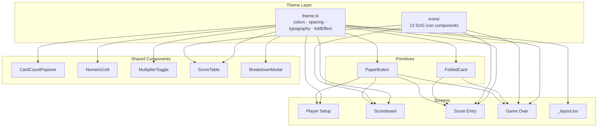

# Design Document: Origami Theme

## Overview

This design transforms the Sea Salt & Paper score tracker from its current blue/white utility style into an origami-inspired visual theme that matches the board game's art direction. The approach is:

1. A centralized theme file (`src/theme/theme.ts`) providing color tokens, spacing, typography, and fold-effect constants
2. An SVG icon set (`src/theme/icons/`) replacing all emoji with geometric origami-style illustrations
3. Two reusable primitives — `FoldedCard` and `PaperButton` — that encapsulate the paper-fold aesthetic
4. Incremental migration of all 4 screens and 5 shared components to consume theme tokens and new primitives

The migration is purely visual — no game logic, state management, or navigation changes.

## Architecture



All theme consumption is one-directional: screens and components import from the theme layer, never the reverse. The theme layer has zero dependencies on app code.

## Components and Interfaces

### Theme File (`src/theme/theme.ts`)

```typescript
export const colors = {
    background: "#FFF8F0", // warm parchment white
    surface: "#FDF5E6", // old lace / sandy paper
    surfaceAlt: "#EDE0D0", // darker parchment for badges
    primary: "#2E7D9B", // deep ocean blue
    primaryDark: "#1B5E7B", // darker ocean for headers
    accent: "#E8734A", // coral accent
    textPrimary: "#2C3E50", // dark slate for body text
    textSecondary: "#7A8B99", // muted blue-grey
    textOnPrimary: "#FFFFFF", // white text on primary bg
    border: "#C4B59D", // warm tan border
    borderLight: "#E0D5C5", // lighter tan for subtle dividers
    error: "#C0392B", // red for errors
    success: "#27AE60", // green for success
} as const;

export const spacing = {
    xs: 4,
    sm: 8,
    md: 16,
    lg: 24,
    xl: 32,
} as const;

export const typography = {
    title: {
        fontSize: 32,
        fontWeight: "700" as const,
        color: colors.textPrimary,
    },
    subtitle: {
        fontSize: 16,
        fontWeight: "600" as const,
        color: colors.textSecondary,
    },
    body: {
        fontSize: 15,
        fontWeight: "400" as const,
        color: colors.textPrimary,
    },
    caption: {
        fontSize: 13,
        fontWeight: "400" as const,
        color: colors.textSecondary,
    },
    label: {
        fontSize: 14,
        fontWeight: "600" as const,
        color: colors.textPrimary,
    },
} as const;

export const foldEffect = {
    shadowColor: "#8B7355",
    shadowOffset: { width: 2, height: 3 },
    shadowOpacity: 0.18,
    shadowRadius: 6,
    elevation: 4,
} as const;

export const foldEffectElevated = {
    shadowColor: "#8B7355",
    shadowOffset: { width: 3, height: 5 },
    shadowOpacity: 0.25,
    shadowRadius: 10,
    elevation: 8,
} as const;
```

### SVG Icon Interface

Each icon component follows a shared interface:

```typescript
interface OrigamiIconProps {
    size?: number; // default 24
    color?: string; // default colors.textPrimary
}
```

Icons: `CrabIcon`, `BoatIcon`, `FishIcon`, `ShellIcon`, `OctopusIcon`, `PenguinIcon`, `SailorIcon`, `MermaidIcon`, `SharkSwimmerIcon`, `TrophyIcon`, `DiceIcon`, `StopHandIcon`, `DeckIcon`

Each renders an `<Svg>` with geometric, angular paths evoking folded paper. All use `react-native-svg` which is already in the project (used implicitly via Expo).

### FoldedCard Component

```typescript
interface FoldedCardProps {
    children: React.ReactNode;
    variant?: "default" | "elevated";
    style?: StyleProp<ViewStyle>;
}
```

- Renders a `View` with `colors.surface` background, `borderRadius: 12`, and `foldEffect` shadow (or `foldEffectElevated` for `"elevated"` variant)
- Includes an absolutely-positioned triangular corner fold in the top-right corner using a small `View` with border tricks (border-top + border-right colored to simulate a folded triangle)
- The corner fold uses `colors.surfaceAlt` for the fold face and `colors.border` for the shadow edge

### PaperButton Component

```typescript
interface PaperButtonProps {
    title: string;
    onPress: () => void;
    variant?: "primary" | "outline";
    disabled?: boolean;
    accessibilityLabel?: string;
}
```

- `"primary"` variant: `colors.primary` background, `colors.textOnPrimary` text, `foldEffect` shadow
- `"outline"` variant: transparent background, `colors.border` border, `colors.primary` text
- Disabled state: `opacity: 0.5`, `onPress` ignored
- Press feedback: `TouchableOpacity` with `activeOpacity={0.7}`

### Emoji-to-Icon Replacement Map

| Current Emoji | Replacement Component | Used In                                            |
| ------------- | --------------------- | -------------------------------------------------- |
| 🦀            | `CrabIcon`            | ScoreTable category header, Score Entry            |
| 🐚            | `ShellIcon`           | ScoreTable category header, Score Entry            |
| 🧜            | `MermaidIcon`         | ScoreTable category header, Score Entry, Game Over |
| ✋            | `StopHandIcon`        | Scoreboard round-end label                         |
| 🎲            | `DiceIcon`            | Scoreboard round-end label, BreakdownModal         |
| 🃏            | `DeckIcon`            | Scoreboard round-end label                         |
| 🏆            | `TrophyIcon`          | Scoreboard banner, Game Over trophy, score rows    |
| 🧜‍♀️            | `MermaidIcon`         | Game Over mermaid badge                            |

### Screen Migration Strategy

Each screen migration follows the same pattern:

1. Import `colors`, `spacing`, `typography` from theme
2. Replace hardcoded color values in `StyleSheet.create()` with theme tokens
3. Replace emoji text with SVG icon components
4. Replace `TouchableOpacity` buttons with `PaperButton`
5. Wrap card-like containers with `FoldedCard`

No structural or behavioral changes — only style values and component swaps.

## Data Models

No new data models are introduced. This feature is purely presentational. The existing types in `src/types.ts` remain unchanged.

The theme file exports plain objects (not React context or state) — they are imported as static constants. This avoids unnecessary re-renders and keeps the theme layer zero-cost at runtime.

### File Structure

```
src/
  theme/
    theme.ts              # colors, spacing, typography, foldEffect exports
    icons/
      index.ts            # barrel export for all icons
      CrabIcon.tsx
      BoatIcon.tsx
      FishIcon.tsx
      ShellIcon.tsx
      OctopusIcon.tsx
      PenguinIcon.tsx
      SailorIcon.tsx
      MermaidIcon.tsx
      SharkSwimmerIcon.tsx
      TrophyIcon.tsx
      DiceIcon.tsx
      StopHandIcon.tsx
      DeckIcon.tsx
    FoldedCard.tsx         # reusable card primitive
    PaperButton.tsx        # reusable button primitive
```

## Correctness Properties

_A property is a characteristic or behavior that should hold true across all valid executions of a system — essentially, a formal statement about what the system should do. Properties serve as the bridge between human-readable specifications and machine-verifiable correctness guarantees._

### Property 1: Typography presets are complete

_For any_ typography preset key in the theme's `typography` object, the preset value shall contain `fontSize` (number), `fontWeight` (string), and `color` (string) properties.

**Validates: Requirements 1.4**

### Property 2: All icons accept size and color with defaults

_For any_ icon component in the SVG_Icon_Set, rendering it with no props shall produce a valid element, and rendering it with arbitrary `size` (positive number) and `color` (valid hex string) props shall produce a valid element whose root Svg has the given width/height and fill/stroke color.

**Validates: Requirements 2.2**

### Property 3: FoldedCard applies surface styling to any children

_For any_ React node passed as children to FoldedCard, the outermost wrapper View shall have `backgroundColor` equal to `colors.surface`, a non-zero `borderRadius`, and shadow properties matching `foldEffect`.

**Validates: Requirements 3.1**

### Property 4: FoldedCard elevated variant has stronger shadow

_For any_ FoldedCard, the `"elevated"` variant shall produce shadow values (shadowOpacity, shadowRadius, elevation) that are each strictly greater than those of the `"default"` variant.

**Validates: Requirements 3.3**

### Property 5: PaperButton renders correctly for all valid prop combinations

_For any_ valid combination of PaperButton props (title string, variant in `{"primary", "outline"}`, disabled boolean), the component shall render without error, and the `"primary"` variant shall have `colors.primary` background while the `"outline"` variant shall have a transparent/no-fill background with `colors.border` border.

**Validates: Requirements 4.1, 4.2**

### Property 6: PaperButton disabled state prevents interaction

_For any_ PaperButton with `disabled={true}`, the rendered component shall have reduced opacity (< 1.0) and pressing it shall not invoke the `onPress` callback.

**Validates: Requirements 4.3**

## Error Handling

This feature is purely presentational and introduces no new error states. Existing error handling (validation errors in ScoreTable, navigation guards in screens) remains unchanged.

Defensive considerations:

- Icon components should gracefully handle `size={0}` or negative sizes by clamping to a minimum of 1
- FoldedCard and PaperButton should pass through any unrecognized style props without breaking
- If `react-native-svg` is somehow unavailable, icon components will throw at import time — this is acceptable since it's a hard dependency already present in the project

## Testing Strategy

### Unit Tests (Example-Based)

Unit tests verify specific, concrete expectations:

- **Theme structure**: Verify `colors` has all 13 required keys, `spacing` has 5 keys with numeric values, `foldEffect` has all 5 shadow keys
- **Theme values**: Verify specific palette values (e.g., `colors.background === '#FFF8F0'`)
- **Icon exports**: Verify all 13 icons are exported from the barrel file
- **FoldedCard corner fold**: Verify the component renders an absolutely-positioned child for the corner decoration
- **PaperButton press feedback**: Verify the component uses `TouchableOpacity` with `activeOpacity` set
- **Screen migrations**: Snapshot or style-check tests verifying screens use theme tokens instead of hardcoded hex values

### Property-Based Tests

Property tests use `fast-check` (already in devDependencies) to verify universal properties across generated inputs:

- Each property test runs a minimum of 100 iterations
- Each test is tagged with a comment: `Feature: origami-theme, Property {N}: {title}`
- Properties 1-6 from the Correctness Properties section above are each implemented as a single property-based test

**Property test approach:**

- Property 1: Generate random keys from the typography object, assert shape
- Property 2: Generate random (size, color) pairs, render each icon, assert output
- Property 3: Generate random React children (Text, View, nested), wrap in FoldedCard, assert wrapper styles
- Property 4: Render FoldedCard with both variants, compare shadow numeric values
- Property 5: Generate random (title, variant, disabled) tuples, render PaperButton, assert variant-specific styles
- Property 6: Generate random PaperButton props with disabled=true, simulate press, assert onPress not called
