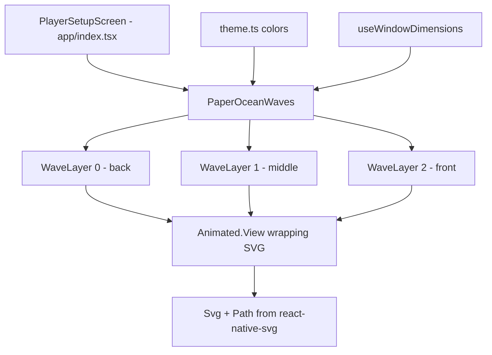

# Design Document: Paper Ocean Waves

## Overview

This feature adds an animated paper-textured ocean wave effect to the bottom of the player setup screen (`app/index.tsx`). The implementation uses `react-native-svg` for wave shape rendering and the React Native `Animated` API (with `useNativeDriver: true`) for smooth horizontal swaying animations.

The wave component is a self-contained `PaperOceanWaves` component that renders three SVG wave layers at different depths, each with distinct colors from the theme, distinct wave shapes, and independent animation timing. It is placed behind all interactive content using absolute positioning with `pointerEvents="none"`.

## Architecture



The `PaperOceanWaves` component is rendered inside `PlayerSetupScreen` as a sibling to the `KeyboardAvoidingView`, positioned absolutely at the bottom. The component is purely visual and has no interaction with the form state.

### Key Design Decisions

1. **Standalone component**: `PaperOceanWaves` is a single file in `src/components/PaperOceanWaves.tsx`. It encapsulates all wave layer rendering and animation logic. No props are required.

2. **SVG paths for wave shapes**: Each wave layer is an SVG `Path` using cubic Bézier curves. The path is generated by a pure function `buildWavePath(width, amplitude, frequency, phase)` that produces a closed path string. The path extends to 200% of screen width to allow horizontal translation without gaps.

3. **Native-driven Animated.View translation**: Each wave layer is wrapped in an `Animated.View` whose `translateX` is driven by a looping `Animated.timing` animation with `useNativeDriver: true`. This keeps the JS thread free and avoids re-renders of the form.

4. **Three layers with distinct parameters**: Each layer has a unique combination of fill color, opacity, amplitude, frequency, vertical offset, animation duration, and animation direction. This creates organic, non-mechanical motion.

5. **useWindowDimensions for responsiveness**: The component reads screen width/height via `useWindowDimensions` and recomputes wave paths when dimensions change.

## Components and Interfaces

### PaperOceanWaves

**File**: `src/components/PaperOceanWaves.tsx`

```typescript
// No props needed — reads dimensions and theme internally
export default function PaperOceanWaves(): React.ReactElement;
```

**Responsibilities**:

- Renders a container `View` with `position: 'absolute'`, `bottom: 0`, `pointerEvents: 'none'`
- Creates three wave layer configurations (color, opacity, amplitude, frequency, vertical offset, animation duration)
- For each layer: renders an `Animated.View` containing an `Svg` > `Path`
- Starts looping animations on mount, cleans up on unmount

### buildWavePath (pure utility function)

```typescript
export function buildWavePath(
    width: number,
    height: number,
    amplitude: number,
    frequency: number,
    phase: number,
): string;
```

**Parameters**:

- `width`: Total path width (typically 2× screen width)
- `height`: Total SVG viewBox height
- `amplitude`: Vertical displacement of wave crests (pixels)
- `frequency`: Number of complete wave cycles across the width
- `phase`: Horizontal phase offset (0–1) to differentiate layers

**Returns**: An SVG path `d` string using cubic Bézier curves (`C` commands) that draws a wave crest line across the top and closes to the bottom-right and bottom-left corners, forming a filled wave shape.

### Wave Layer Configuration

```typescript
interface WaveLayerConfig {
    color: string; // Fill color from theme
    opacity: number; // 0–1, back layers more translucent
    amplitude: number; // Wave crest height in px
    frequency: number; // Number of wave cycles
    phase: number; // Phase offset 0–1
    duration: number; // Animation cycle duration in ms
    offsetY: number; // Vertical offset from container bottom
    reverse: boolean; // Whether animation direction is reversed
}
```

Three default configs:

| Layer  | Color                | Opacity | Amplitude | Frequency | Duration | offsetY | Reverse |
| ------ | -------------------- | ------- | --------- | --------- | -------- | ------- | ------- |
| Back   | `colors.primaryDark` | 0.35    | 20        | 1.5       | 8000ms   | 0       | false   |
| Middle | `colors.primary`     | 0.5     | 25        | 1.2       | 6000ms   | 12      | true    |
| Front  | `colors.surfaceAlt`  | 0.85    | 18        | 1.8       | 4500ms   | 24      | false   |

### Integration into PlayerSetupScreen

In `app/index.tsx`, the `PaperOceanWaves` component is added as a child of the `SafeAreaView`, rendered before the `KeyboardAvoidingView` so it sits behind all interactive content in the z-order:

```tsx
<SafeAreaView style={styles.safeArea}>
    <PaperOceanWaves />
    <KeyboardAvoidingView ...>
        ...
    </KeyboardAvoidingView>
</SafeAreaView>
```

## Data Models

No persistent data models are introduced. All wave configuration is defined as constants within the component. The only runtime state is the `Animated.Value` instances for each layer's `translateX`, which are created via `useRef` and not stored externally.

## Correctness Properties

_A property is a characteristic or behavior that should hold true across all valid executions of a system — essentially, a formal statement about what the system should do. Properties serve as the bridge between human-readable specifications and machine-verifiable correctness guarantees._

### Property 1: buildWavePath produces valid SVG paths with Bézier curves

_For any_ valid positive width, height, amplitude (> 0), frequency (> 0), and phase (0–1), `buildWavePath` should return a non-empty string that starts with `M`, contains at least one cubic Bézier `C` command, and ends with `Z` — forming a closed SVG path.

**Validates: Requirements 3.1, 3.2**

### Property 2: Wave layer configs are mutually distinct

_For any_ set of wave layer configurations produced by the component, all fill colors should be pairwise distinct, all amplitude/frequency pairs should be pairwise distinct, and all animation durations should be pairwise distinct.

**Validates: Requirements 2.2, 3.3, 4.3, 6.1**

### Property 3: Animation durations within valid range

_For any_ wave layer configuration, the animation cycle duration should be >= 3000ms and <= 8000ms.

**Validates: Requirements 4.4**

### Property 4: Wave SVG width covers screen with margin

_For any_ screen width > 0, the SVG viewBox width used for each wave layer should be >= 1.5 × the screen width.

**Validates: Requirements 2.4**

### Property 5: Wave container height is proportional to screen

_For any_ screen height > 0, the wave container height should be between 20% and 30% (inclusive) of the screen height.

**Validates: Requirements 7.2**

### Property 6: Back-to-front opacity ordering

_For any_ pair of wave layers where layer A is behind layer B (lower index), the opacity of layer A should be strictly less than the opacity of layer B.

**Validates: Requirements 2.3, 6.3**

### Property 7: buildWavePath varies with amplitude

_For any_ fixed width, height, frequency, and phase, calling `buildWavePath` with two different amplitude values should produce two different path strings. This is a metamorphic property ensuring the wave shape actually responds to its parameters.

**Validates: Requirements 3.3**

## Error Handling

This feature is purely visual and decorative. There are no user inputs, network calls, or data mutations involved.

- **Invalid dimensions**: If `useWindowDimensions` returns 0 for width or height (e.g., during initial mount race), the component should render nothing (return `null`) until valid dimensions are available.
- **SVG rendering failure**: If `react-native-svg` fails to render (extremely unlikely), the component is wrapped in the app's existing `ErrorBoundary` so it won't crash the setup screen. The waves simply won't appear.
- **Animation cleanup**: All `Animated.timing` loops are stopped in the `useEffect` cleanup function to prevent memory leaks on unmount.

## Testing Strategy

### Unit Tests (Jest + React Native Testing Library)

Unit tests cover specific examples and structural checks:

- The component renders three wave layers inside the container
- The container has `position: 'absolute'`, `bottom: 0`, and `pointerEvents: 'none'`
- The container background is transparent
- `useNativeDriver: true` is set in animation configs
- Animations are cleaned up on unmount
- The component renders `null` when screen dimensions are 0

### Property-Based Tests (fast-check)

Property tests validate universal correctness across generated inputs. The project already uses `fast-check`.

Each property test runs a minimum of 100 iterations.

Each test is tagged with a comment referencing the design property:

- **Feature: paper-ocean-waves, Property 1: buildWavePath produces valid SVG paths with Bézier curves**
- **Feature: paper-ocean-waves, Property 2: Wave layer configs are mutually distinct**
- **Feature: paper-ocean-waves, Property 3: Animation durations within valid range**
- **Feature: paper-ocean-waves, Property 4: Wave SVG width covers screen with margin**
- **Feature: paper-ocean-waves, Property 5: Wave container height is proportional to screen**
- **Feature: paper-ocean-waves, Property 6: Back-to-front opacity ordering**
- **Feature: paper-ocean-waves, Property 7: buildWavePath varies with amplitude**

Each correctness property is implemented by a single property-based test. The `buildWavePath` function is exported as a pure function specifically to enable direct property testing without rendering.

### Test File Location

- `src/components/__tests__/PaperOceanWaves.test.tsx` — unit tests
- `src/components/__tests__/PaperOceanWaves.property.test.ts` — property-based tests
