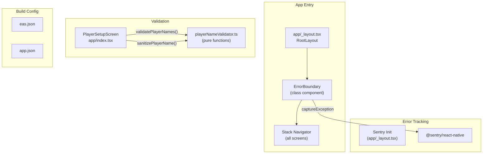

# Design Document — Production Readiness

## Overview

This design covers the minimum changes needed to ship Sea Salt & Paper Scorer to the Google Play Store and Apple App Store. The work spans three areas:

1. **Runtime error resilience** — A root error boundary component that catches unhandled JS errors and renders a recovery UI, plus Sentry integration for remote crash reporting.
2. **Build & store configuration** — An `eas.json` with dev/preview/production profiles, real package/bundle identifiers, version codes, and store metadata fields in `app.json`.
3. **Input validation & sanitization** — A pure validator module for player names with length limits, duplicate detection, whitespace normalization, and HTML tag stripping on web.

The design keeps changes minimal and focused. Error boundary and Sentry are wired into the existing `app/_layout.tsx`. Validation is extracted into a standalone pure-function module (`src/validation/playerNameValidator.ts`) that the Player Setup screen consumes. Build config is purely declarative (JSON files).

## Architecture



### Key Decisions

- **Class component for ErrorBoundary**: React error boundaries require `componentDidCatch` / `getDerivedStateFromError`, which are only available on class components. We won't use `@sentry/react-native`'s built-in `Sentry.ErrorBoundary` wrapper because we need custom reset logic (calling `newGame()` on corrupted state).
- **Sentry disabled in dev**: Controlled via `__DEV__` flag at init time — no DSN is set when `__DEV__` is true, so no SDK traffic in development.
- **Pure validator module**: Validation and sanitization are pure functions with no side effects, making them trivially testable with property-based tests. The module lives in `src/validation/` separate from game logic.
- **Idempotent sanitization**: The sanitize function is designed so `sanitize(sanitize(x)) === sanitize(x)` — this is a key correctness property.

## Components and Interfaces

### ErrorBoundary Component

**File:** `src/components/ErrorBoundary.tsx`

```typescript
interface ErrorBoundaryProps {
    children: React.ReactNode;
}

interface ErrorBoundaryState {
    hasError: boolean;
}

class ErrorBoundary extends React.Component<
    ErrorBoundaryProps,
    ErrorBoundaryState
> {
    static getDerivedStateFromError(_error: Error): ErrorBoundaryState;
    componentDidCatch(error: Error, errorInfo: React.ErrorInfo): void;
    handleReset(): void;
    render(): React.ReactNode;
}
```

- `getDerivedStateFromError` — sets `hasError: true`
- `componentDidCatch` — calls `Sentry.captureException(error)` (only if Sentry is enabled), checks if game store state is corrupted and calls `newGame()` if so
- `handleReset` — sets `hasError: false`, re-renders children
- Fallback UI — centered card with error icon, "Something went wrong" message, and a "Try Again" `PaperButton`

### Sentry Initialization

**Location:** `app/_layout.tsx` (top-level, before component export)

```typescript
import * as Sentry from "@sentry/react-native";
import Constants from "expo-constants";

if (!__DEV__) {
    Sentry.init({
        dsn: Constants.expoConfig?.extra?.sentryDsn ?? "",
        release: Constants.expoConfig?.version ?? "unknown",
    });
}
```

The DSN is read from `expo-constants` extra config, which can be set via environment variables in `eas.json` or `app.config.js`. In dev mode, `Sentry.init` is never called.

### Player Name Validator Module

**File:** `src/validation/playerNameValidator.ts`

```typescript
/**
 * Sanitizes a single player name:
 * 1. Strips HTML tags (web safety)
 * 2. Trims leading/trailing whitespace
 * 3. Collapses consecutive internal whitespace to a single space
 */
export function sanitizePlayerName(name: string): string;

/**
 * Validates an array of player names and returns per-name error messages.
 * Empty string means valid. Checks:
 * - Length after sanitization: 1-20 characters
 * - Duplicate detection (case-insensitive)
 */
export function validatePlayerNames(names: string[]): string[];
```

### Integration with PlayerSetupScreen

The existing `app/index.tsx` will:

1. Call `sanitizePlayerName()` on each name before storing in state (on `onChangeText` or on submit)
2. Call `validatePlayerNames()` on the full names array to get per-field error messages
3. Display inline error text below each `TextInput` when the error string is non-empty
4. Disable "Start Game" when any error string is non-empty
5. Replace the existing `areAllNamesValid()` call with the new validator

## Data Models

### ErrorBoundary State

```typescript
interface ErrorBoundaryState {
    hasError: boolean;
}
```

No new persistent data models are introduced. The error boundary is purely in-memory React state.

### Validation Types

```typescript
// Return type of validatePlayerNames — an array parallel to the input names array.
// Each element is either "" (valid) or a user-facing error message string.
type ValidationErrors = string[];
```

### EAS Build Configuration (`eas.json`)

```json
{
    "cli": { "version": ">= 15.0.0" },
    "build": {
        "development": {
            "developmentClient": true,
            "distribution": "internal"
        },
        "preview": {
            "distribution": "internal"
        },
        "production": {
            "autoIncrement": true
        }
    },
    "submit": {
        "production": {}
    }
}
```

### App.json Updates

Key fields to add/change:

| Field                                         | Value                                     |
| --------------------------------------------- | ----------------------------------------- |
| `android.package`                             | `dev.seasaltpaper.scorer`                 |
| `ios.bundleIdentifier`                        | `dev.seasaltpaper.scorer`                 |
| `ios.buildNumber`                             | `"1"`                                     |
| `android.versionCode`                         | `1`                                       |
| `ios.supportsTablet`                          | `true` (already set)                      |
| `ios.infoPlist.ITSAppUsesNonExemptEncryption` | `false`                                   |
| `android.permissions`                         | `[]`                                      |
| `runtimeVersion.policy`                       | `"appVersion"`                            |
| `extra.sentryDsn`                             | `""` (placeholder, set via env var in CI) |

## Correctness Properties

_A property is a characteristic or behavior that should hold true across all valid executions of a system — essentially, a formal statement about what the system should do. Properties serve as the bridge between human-readable specifications and machine-verifiable correctness guarantees._

### Property 1: Name length validation

_For any_ string `s`, if `sanitize(s)` has length < 1 or > 20, then `validatePlayerNames([s])` must return a non-empty error string for that name; conversely, if the sanitized length is between 1 and 20 (inclusive) and there are no duplicates, the error string must be empty.

**Validates: Requirements 5.1**

### Property 2: Duplicate name detection

_For any_ array of player name strings where two or more names are identical after sanitization and case-insensitive comparison, `validatePlayerNames()` must return a non-empty error string for at least one of the duplicate names.

**Validates: Requirements 5.2**

### Property 3: Validator output length invariant

_For any_ array of `n` player name strings, `validatePlayerNames()` must return an array of exactly `n` elements.

**Validates: Requirements 5.5**

### Property 4: Sanitization output format

_For any_ string `s`, `sanitizePlayerName(s)` must produce a result that has no leading or trailing whitespace, contains no HTML tags (no `<...>` sequences), and contains no consecutive whitespace characters.

**Validates: Requirements 6.1, 6.2, 6.3**

### Property 5: Sanitization idempotence

_For any_ string `s`, `sanitizePlayerName(sanitizePlayerName(s))` must be strictly equal to `sanitizePlayerName(s)`.

**Validates: Requirements 6.4**

## Error Handling

### Error Boundary

| Scenario                                                                                 | Behavior                                                                 |
| ---------------------------------------------------------------------------------------- | ------------------------------------------------------------------------ |
| JS error in any child component                                                          | ErrorBoundary catches it, renders fallback UI with "Try Again" button    |
| User presses "Try Again"                                                                 | ErrorBoundary resets `hasError` to `false`, re-renders children          |
| Error caught + game store state is corrupted (e.g. `gameSession` has no `players` array) | ErrorBoundary calls `useGameStore.getState().newGame()` before resetting |
| Error caught + Sentry enabled                                                            | `Sentry.captureException(error)` is called in `componentDidCatch`        |
| Error caught + Sentry disabled (`__DEV__`)                                               | No Sentry call; error is only logged to console                          |

### Validation Errors

| Scenario                                   | Error Message                          |
| ------------------------------------------ | -------------------------------------- |
| Name is empty after sanitization           | `"Name is required"`                   |
| Name exceeds 20 characters                 | `"Name must be 20 characters or less"` |
| Name duplicates another (case-insensitive) | `"Name is already taken"`              |

Validation errors are returned as strings in the array from `validatePlayerNames()`. The UI displays them inline below each input. No exceptions are thrown for validation failures.

### Sentry Initialization Failures

If the Sentry DSN is missing or invalid, `Sentry.init()` will silently fail (Sentry SDK's default behavior). The app continues to function normally without error tracking. This is acceptable for development and early testing.

## Testing Strategy

### Unit Tests (Jest)

- **Error Boundary**: Component tests using `@testing-library/react-native` that render a child component which throws, verify fallback UI appears, verify "Try Again" resets, verify `newGame()` is called on corrupted state.
- **Sentry integration**: Mock `@sentry/react-native` and verify `captureException` is called when ErrorBoundary catches an error; verify `Sentry.init` is not called when `__DEV__` is true.
- **Config validation**: Snapshot or assertion tests that read `eas.json` and `app.json` and verify required fields are present (build profiles, identifiers, version codes, permissions).
- **Validator examples**: Specific example tests for edge cases — empty string, whitespace-only, exactly 20 chars, exactly 21 chars, names with HTML tags, names with mixed case duplicates.

### Property-Based Tests (fast-check)

Each correctness property above is implemented as a single property-based test using `fast-check`. Each test runs a minimum of 100 iterations.

- **Property 1 (Name length validation)**: Generate arbitrary strings via `fc.string()`. Sanitize, check length, assert validation result matches.
    - Tag: `Feature: production-readiness, Property 1: Name length validation`
- **Property 2 (Duplicate name detection)**: Generate arrays of strings where at least two are case-insensitively equal. Assert validator flags duplicates.
    - Tag: `Feature: production-readiness, Property 2: Duplicate name detection`
- **Property 3 (Validator output length invariant)**: Generate arrays of 2-4 strings. Assert output array length equals input array length.
    - Tag: `Feature: production-readiness, Property 3: Validator output length invariant`
- **Property 4 (Sanitization output format)**: Generate arbitrary strings (including strings with `<`, `>`, multiple spaces, leading/trailing whitespace). Assert sanitized output has no leading/trailing whitespace, no HTML tags, no consecutive spaces.
    - Tag: `Feature: production-readiness, Property 4: Sanitization output format`
- **Property 5 (Sanitization idempotence)**: Generate arbitrary strings. Assert `sanitize(sanitize(s)) === sanitize(s)`.
    - Tag: `Feature: production-readiness, Property 5: Sanitization idempotence`

### Test File Organization

| Test File                                                   | Type      | Covers                                        |
| ----------------------------------------------------------- | --------- | --------------------------------------------- |
| `src/__tests__/playerNameValidator.test.ts`                 | Unit      | Validator examples, edge cases                |
| `src/__tests__/playerNameValidator.property.test.ts`        | PBT       | Properties 1-5                                |
| `src/components/__tests__/ErrorBoundary.component.test.tsx` | Component | Error boundary rendering, reset, Sentry calls |

### PBT Library

- **Library**: `fast-check` (already in devDependencies)
- **Min iterations**: 100 per property
- **Each test must reference its design property** using the tag format: `Feature: production-readiness, Property {N}: {title}`
- **Each correctness property is implemented by exactly one property-based test**
