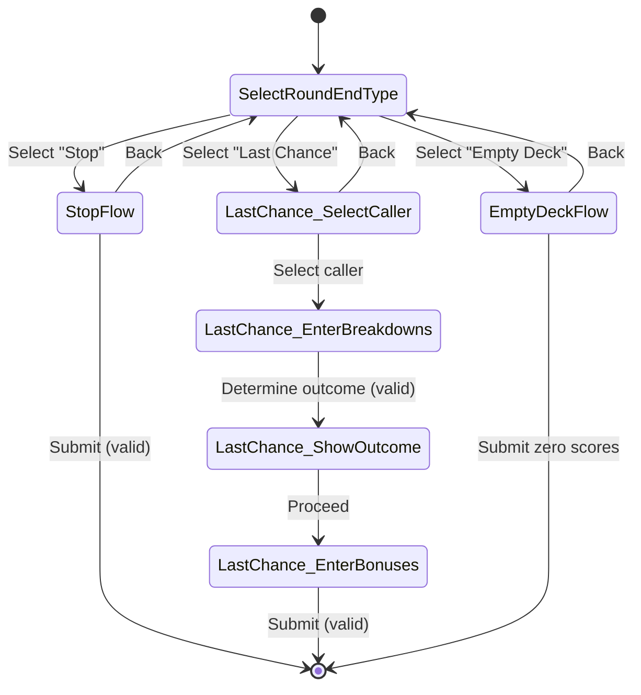
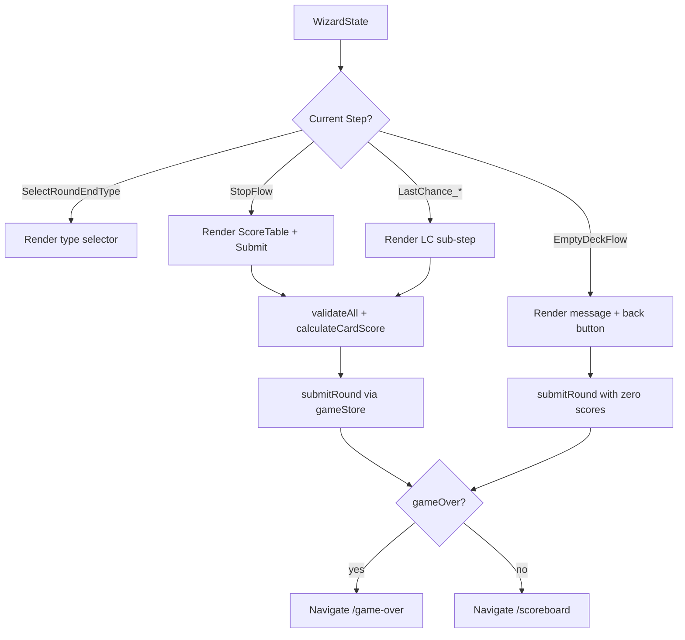

# Design Document: Score Entry Wizard

## Overview

This design refactors the monolithic `app/score-entry.tsx` screen into a multi-step wizard flow. Instead of showing all controls at once with conditional rendering, the wizard presents a clear step-by-step experience:

1. **Step 1** — Round End Type Selection (always shown first)
2. **Step 2** — Branching sub-flow based on selection:
    - **Stop Flow**: ScoreTable → Submit
    - **Last Chance Flow**: Select Caller → Enter Breakdowns → Determine Outcome → Color Bonuses → Submit
    - **Empty Deck Flow**: Informational message → Submit zero scores → Navigate back

The wizard is implemented as internal state management within the single `app/score-entry.tsx` route (no new routes). A state machine pattern drives step transitions, keeping shared state (breakdowns, card scores) accessible across all steps.

### Key Design Decisions

- **Single screen, internal wizard state**: The wizard lives inside `app/score-entry.tsx` using a discriminated union state machine rather than separate Expo Router screens. This avoids prop-drilling or global state for transient wizard data and keeps the URL structure unchanged.
- **State machine pattern**: A `WizardState` discriminated union type models all valid wizard states and transitions. This makes illegal states unrepresentable and simplifies conditional rendering.
- **Preserve breakdowns on back-navigation**: Card breakdown data is stored outside the wizard state machine so it persists when the user navigates back to step 1 and re-enters a sub-flow.
- **Reuse existing components**: `ScoreTable`, `NumericCell`, `PaperButton`, `FoldedCard` are reused as-is. No new shared components are needed.

## Architecture

The wizard is contained entirely within the `app/score-entry.tsx` screen component. The architecture follows a state machine pattern with a reducer-like approach.



### Data Flow



## Components and Interfaces

### WizardStep Renderer (inside `app/score-entry.tsx`)

The main screen component uses a `switch` on the wizard state's `step` field to render the appropriate sub-flow. Each sub-flow is a local function component or inline JSX block — not a separate file — since they share the same state context.

#### Wizard State Machine

```typescript
type WizardStep =
    | { step: "selectRoundEndType" }
    | { step: "stopFlow" }
    | { step: "lastChance_selectCaller" }
    | { step: "lastChance_enterBreakdowns"; callerIndex: number }
    | {
          step: "lastChance_showOutcome";
          callerIndex: number;
          outcome: LastChanceOutcome;
      }
    | {
          step: "lastChance_enterBonuses";
          callerIndex: number;
          outcome: LastChanceOutcome;
      }
    | { step: "emptyDeckFlow" };
```

#### Transition Functions

```typescript
function goToStep1(): void;
// Resets wizard state to { step: 'selectRoundEndType' }
// Does NOT reset breakdowns or colorBonuses

function selectRoundEndType(type: RoundEndType): void;
// Transitions to the appropriate sub-flow initial step
// 'STOP' → { step: 'stopFlow' }
// 'LAST_CHANCE' → { step: 'lastChance_selectCaller' }
// 'EMPTY_DECK' → { step: 'emptyDeckFlow' }

function selectCaller(playerIndex: number): void;
// Transitions from lastChance_selectCaller → lastChance_enterBreakdowns

function determineOutcome(): void;
// Validates breakdowns, calculates outcome
// Transitions from lastChance_enterBreakdowns → lastChance_showOutcome

function proceedToBonuses(): void;
// Transitions from lastChance_showOutcome → lastChance_enterBonuses

function submitRound(): void;
// Final submission for Stop and Last Chance flows

function submitEmptyDeck(): void;
// Submits zero scores for all players
```

### Existing Components (Reused)

| Component     | Location                         | Role in Wizard                                               |
| ------------- | -------------------------------- | ------------------------------------------------------------ |
| `ScoreTable`  | `src/components/ScoreTable.tsx`  | Card breakdown entry in Stop and Last Chance flows           |
| `NumericCell` | `src/components/NumericCell.tsx` | Color bonus entry in Last Chance flow                        |
| `PaperButton` | `src/theme/PaperButton.tsx`      | All buttons (type selection, submit, back, caller selection) |
| `FoldedCard`  | `src/theme/FoldedCard.tsx`       | Card containers for step content                             |

### New Internal Sub-Components

These are defined inside `app/score-entry.tsx` or extracted to a local helper file if needed:

- **`RoundEndTypeSelector`**: Renders three `PaperButton`s for Stop / Last Chance / Empty Deck with the round number title.
- **`StopFlowView`**: Renders `ScoreTable` + back button + submit button.
- **`LastChanceFlowView`**: Renders the appropriate Last Chance sub-step based on wizard state. Contains sub-views for caller selection, breakdown entry, outcome display, and bonus entry.
- **`EmptyDeckFlowView`**: Renders informational message + back button + confirm button.

## Data Models

### Wizard State (New)

```typescript
// Discriminated union representing all wizard states
type WizardStep =
    | { step: "selectRoundEndType" }
    | { step: "stopFlow" }
    | { step: "lastChance_selectCaller" }
    | { step: "lastChance_enterBreakdowns"; callerIndex: number }
    | {
          step: "lastChance_showOutcome";
          callerIndex: number;
          outcome: LastChanceOutcome;
      }
    | {
          step: "lastChance_enterBonuses";
          callerIndex: number;
          outcome: LastChanceOutcome;
      }
    | { step: "emptyDeckFlow" };
```

### Persisted State (Across Wizard Steps)

These values live as `useState` hooks in the screen component, outside the wizard state machine, so they survive back-navigation:

```typescript
// Card breakdowns — one per player, initialized to createEmptyBreakdown()
const [breakdowns, setBreakdowns] = useState<CardBreakdown[]>([]);

// Color bonuses — one per player, initialized to 0
const [colorBonuses, setColorBonuses] = useState<number[]>([]);

// Validation state
const [validationErrors, setValidationErrors] = useState<string[][]>([]);
const [crossPlayerErrors, setCrossPlayerErrors] = useState<string[]>([]);
const [submitAttempted, setSubmitAttempted] = useState(false);
```

### Existing Types (Unchanged)

All existing types from `src/types.ts` remain unchanged:

- `RoundEndType`, `CardBreakdown`, `PlayerCardBreakdown`, `LastChanceRoundData`, `LastChanceOutcome`, `PlayerRoundScore`, `ValidationResult`

### Existing Store Interface (Unchanged)

The `GameStore` interface in `src/store/gameStore.ts` remains unchanged. The wizard calls:

- `submitRound(scores, roundEndType, breakdowns?, lastChanceData?)` — for all flows
- `declareMermaidWin(playerIndex)` — for mermaid instant win detection

## Correctness Properties

_A property is a characteristic or behavior that should hold true across all valid executions of a system — essentially, a formal statement about what the system should do. Properties serve as the bridge between human-readable specifications and machine-verifiable correctness guarantees._

### Property 1: Round end type selection produces correct wizard state

_For any_ valid `RoundEndType` value ("STOP", "LAST_CHANCE", "EMPTY_DECK"), calling `selectRoundEndType` from the initial state should transition the wizard to the corresponding sub-flow initial step: "STOP" → `stopFlow`, "LAST_CHANCE" → `lastChance_selectCaller`, "EMPTY_DECK" → `emptyDeckFlow`.

**Validates: Requirements 1.2**

### Property 2: Invalid breakdowns block submission and preserve wizard step

_For any_ set of card breakdowns that fail validation (per-player or cross-player), attempting to submit in the Stop Flow should not call `submitRound` and the wizard state should remain on `stopFlow` with validation errors populated.

**Validates: Requirements 2.3, 2.4**

### Property 3: Valid breakdowns in Stop Flow produce correct round scores

_For any_ set of valid card breakdowns for all players, submitting in the Stop Flow should call `submitRound` with scores equal to `calculateCardScore(breakdown)` for each player, round end type "STOP", and the full set of `PlayerCardBreakdown` objects.

**Validates: Requirements 2.5**

### Property 4: Caller selection transitions to enter-breakdowns with correct caller index

_For any_ valid player index in the game session, selecting that player as the Last Chance caller should transition the wizard to `lastChance_enterBreakdowns` with `callerIndex` set to that player index.

**Validates: Requirements 3.3**

### Property 5: Last Chance outcome is correctly determined from card scores

_For any_ set of valid card breakdowns and any valid caller index, the Last Chance outcome should be "won" if the caller's card score is greater than or equal to every opponent's card score, and "lost" otherwise.

**Validates: Requirements 3.4**

### Property 6: Color bonus fields match outcome rules

_For any_ Last Chance outcome and set of players, when the outcome is "won" the color bonus entry should show fields for all players, and when the outcome is "lost" the color bonus entry should show a field only for the caller.

**Validates: Requirements 3.6**

### Property 7: Last Chance submission produces correct round scores

_For any_ valid set of card breakdowns, valid caller index, determined outcome, and valid color bonuses, submitting in the Last Chance Flow should call `submitRound` with scores computed by `calculateLastChanceRoundScores` and the correct `LastChanceRoundData`.

**Validates: Requirements 3.7**

### Property 8: Back navigation resets wizard state but preserves breakdowns

_For any_ non-initial wizard state and any set of card breakdowns entered in the ScoreTable, calling `goToStep1` should reset the wizard state to `selectRoundEndType` (clearing sub-flow-specific state like callerIndex and outcome) while the card breakdown array remains unchanged.

**Validates: Requirements 2.6, 3.9, 4.4, 5.1, 5.2, 5.3**

### Property 9: Empty Deck submission produces zero scores for all players

_For any_ game session with N players (2-4), submitting in the Empty Deck Flow should call `submitRound` with a score of 0 for every player and round end type "EMPTY_DECK".

**Validates: Requirements 4.3**

### Property 10: Mermaid instant win triggers at count 4

_For any_ player in any flow that uses the ScoreTable (Stop Flow or Last Chance Flow), when that player's mermaid count is set to 4, the `onMermaidInstantWin` callback should be invoked with that player's index.

**Validates: Requirements 6.1**

## Error Handling

### Validation Errors

- **Per-player card breakdown validation**: Uses existing `validateCardBreakdown()` from `scoringEngine.ts`. Errors are displayed per-player in the ScoreTable's validation row.
- **Cross-player deck limit validation**: Uses existing `validateCrossPlayerTotals()`. Errors are displayed in a warning box below the ScoreTable.
- **Color bonus validation**: Color bonuses must be non-negative integers. Invalid values block Last Chance submission.
- **Submission blocked on errors**: When `submitAttempted` is true, validation runs on every breakdown change for immediate feedback. The submit button action re-validates before proceeding.

### Navigation Guards

- **No active session**: If `gameSession` is null when the screen mounts, redirect to `/` (home screen). This matches the existing behavior.
- **Invalid wizard transitions**: The discriminated union type system prevents invalid state transitions at compile time. Runtime transitions are handled by explicit functions that only produce valid next states.

### Edge Cases

- **Mermaid instant win during Last Chance**: If a player reaches 4 mermaids during the Last Chance breakdown entry, the mermaid win prompt takes priority. Confirming it calls `declareMermaidWin` and navigates to game-over, bypassing the rest of the Last Chance flow.
- **Empty player list**: Guarded by the session null check — if there's no session, the screen redirects before rendering.

## Testing Strategy

### Property-Based Testing

Property-based tests will use `fast-check` (already available in the JS/TS ecosystem) to verify the correctness properties defined above. Each property test will:

- Run a minimum of 100 iterations
- Generate random valid inputs (player counts, card breakdowns, caller indices, outcomes)
- Be tagged with a comment referencing the design property

Tag format: `Feature: score-entry-wizard, Property {number}: {property_text}`

Key generators needed:

- `arbitraryRoundEndType`: generates one of "STOP", "LAST_CHANCE", "EMPTY_DECK"
- `arbitraryCardBreakdown`: generates valid `CardBreakdown` objects within deck limits
- `arbitraryInvalidCardBreakdown`: generates `CardBreakdown` objects that fail validation
- `arbitraryPlayerCount`: generates 2, 3, or 4
- `arbitraryCallerIndex(playerCount)`: generates a valid player index
- `arbitraryWizardState`: generates any valid `WizardStep` value
- `arbitraryColorBonuses(playerCount)`: generates valid color bonus arrays

### Unit Testing

Unit tests complement property tests for specific examples and edge cases:

- Rendering tests: Verify that each wizard step renders the correct UI elements (buttons, ScoreTable, messages)
- Caller badge visibility across Last Chance sub-steps
- Round number display in the type selector
- Mermaid instant win confirmation dialog
- No-session redirect behavior
- Empty Deck message content

### Test Organization

- Property tests: `src/components/__tests__/ScoreEntryWizard.property.test.tsx`
- Unit tests: `src/components/__tests__/ScoreEntryWizard.test.tsx`
- Each property test must reference its design property with the tag format specified above
- Each correctness property is implemented by a single property-based test
