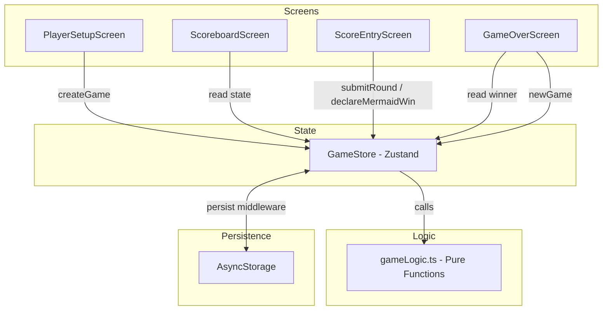
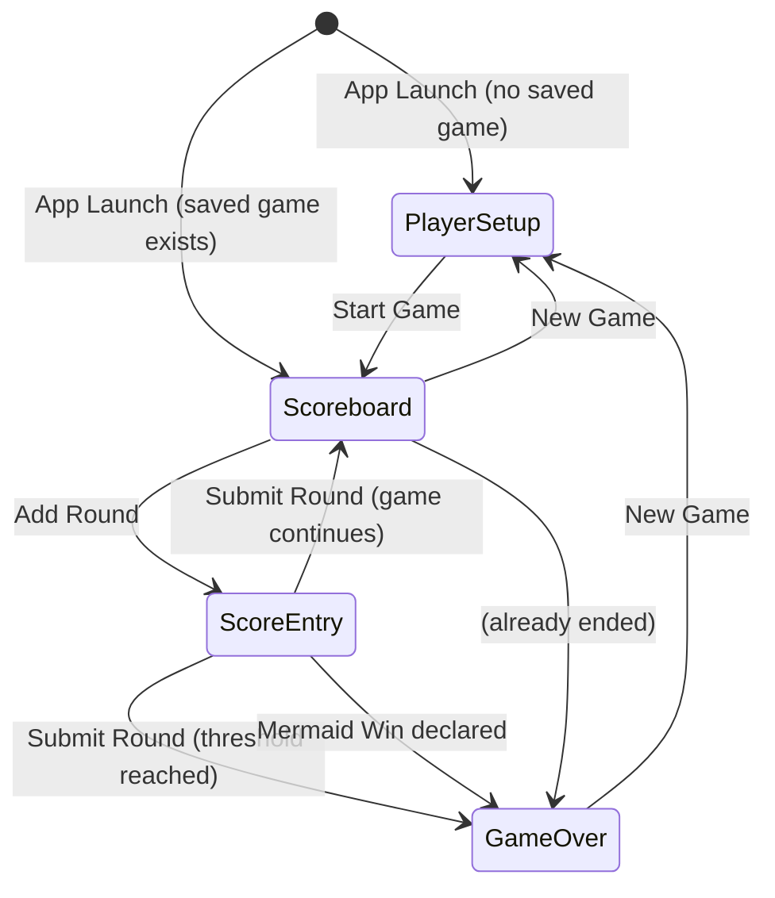
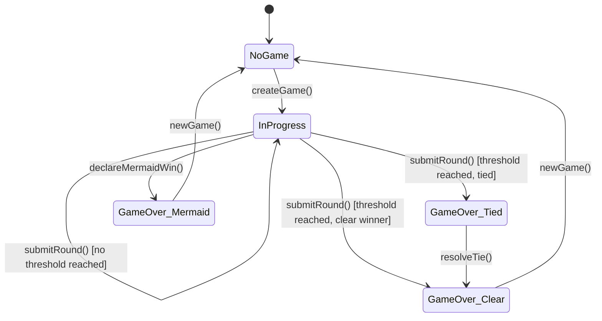

# Design Document: Sea Salt and Paper Scorer

## Overview

Sea Salt and Paper Scorer is a cross-platform score tracking app for the card game Sea Salt and Paper. It is built with React Native and Expo, enabling deployment to iOS, Android, and the web from a single TypeScript codebase. The app manages player setup, per-round score entry (with round-end context), a running scoreboard, end-game detection with tie-breaking, mermaid instant win, and local data persistence.

The app is a pure score tracker — it does not simulate gameplay, manage cards, or enforce turn order. All game logic is limited to score arithmetic, threshold comparison, and win-condition evaluation.

### Key Design Decisions

- **React Native + Expo**: Satisfies the single-codebase, three-platform requirement (Req 1). Expo provides managed builds for iOS/Android and `expo-router` for file-based navigation.
- **TypeScript**: Strong typing for game state, round data, and score logic reduces bugs in threshold and tie-breaking logic.
- **Zustand for State Management**: Lightweight, minimal boilerplate, works well with React Native and supports middleware for persistence.
- **AsyncStorage for Persistence**: `@react-native-async-storage/async-storage` works across all three platforms and integrates with Zustand's `persist` middleware (Req 9).
- **Pure Functions for Game Logic**: All score calculation, threshold checking, and win detection are implemented as pure functions, making them easy to test with property-based testing.

## Architecture

The app follows a simple screen-based architecture with centralized state.



### Navigation Flow



## Components and Interfaces

### Screens

| Screen              | Purpose                               | Key Interactions                                                              |
| ------------------- | ------------------------------------- | ----------------------------------------------------------------------------- |
| `PlayerSetupScreen` | Configure 2-4 players with names      | Select player count, enter names, start game                                  |
| `ScoreboardScreen`  | Display running scoreboard            | View scores, navigate to score entry or new game                              |
| `ScoreEntryScreen`  | Enter round scores and round-end type | Input scores per player, select round-end type, submit or declare mermaid win |
| `GameOverScreen`    | Display winner and final scores       | Show winner, handle tie-breaker prompt, start new game                        |

### Game Store Interface (Zustand)

```typescript
interface GameStore {
    // State
    gameSession: GameSession | null;

    // Actions
    createGame: (players: PlayerInput[]) => void;
    submitRound: (
        scores: PlayerRoundScore[],
        roundEndType: RoundEndType,
    ) => RoundResult;
    declareMermaidWin: (playerIndex: number) => void;
    resolveTie: (lastRoundPlayerIndex: number) => void;
    newGame: () => void;
}
```

### Game Logic Module (Pure Functions)

```typescript
// gameLogic.ts — all pure, all testable

function calculateRunningTotals(rounds: Round[]): number[];

function getEndGameThreshold(playerCount: number): number;

function checkGameOver(runningTotals: number[], playerCount: number): boolean;

function determineWinner(
    runningTotals: number[],
    lastRoundPlayerIndex?: number,
): WinResult;

function createRound(
    scores: PlayerRoundScore[],
    roundEndType: RoundEndType,
    roundNumber: number,
): Round;

function serializeGameSession(session: GameSession): string;

function deserializeGameSession(json: string): GameSession;
```

## Data Models

```typescript
type RoundEndType = "STOP" | "LAST_CHANCE" | "EMPTY_DECK";

interface PlayerInput {
    name: string;
    seatIndex: number; // 0-based seating order
}

interface Player {
    name: string;
    seatIndex: number;
}

interface PlayerRoundScore {
    playerIndex: number;
    score: number; // integer >= 0
}

interface Round {
    roundNumber: number; // 1-based
    scores: PlayerRoundScore[];
    roundEndType: RoundEndType;
}

interface GameSession {
    players: Player[];
    rounds: Round[];
    winner: WinResult | null;
    mermaidWin: boolean;
}

interface WinResult {
    playerIndex: number;
    playerName: string;
    isTieBreaker: boolean;
    isMermaidWin: boolean;
}

// Derived (computed, not stored)
interface ScoreboardRow {
    player: Player;
    roundScores: number[]; // score per round
    runningTotal: number;
}
```

### Threshold Table

| Player Count | End-Game Threshold |
| ------------ | ------------------ |
| 2            | 40                 |
| 3            | 35                 |
| 4            | 30                 |

### State Transitions



## Correctness Properties

_A property is a characteristic or behavior that should hold true across all valid executions of a system — essentially, a formal statement about what the system should do. Properties serve as the bridge between human-readable specifications and machine-verifiable correctness guarantees._

### Property 1: Seating order matches list order

_For any_ list of player names provided during setup, the assigned `seatIndex` for each player should equal their index in the input list.

**Validates: Requirements 3.3**

### Property 2: Start button enabled iff all names non-empty

_For any_ set of player name inputs (2-4 players), the start game button should be enabled if and only if every player name is a non-empty, non-whitespace string.

**Validates: Requirements 3.4, 3.5**

### Property 3: Game session created with correct initial state

_For any_ valid list of 2-4 player names, creating a new game session should produce a session with the correct players, zero rounds, null winner, and running totals of zero for all players.

**Validates: Requirements 3.6, 8.3**

### Property 4: Score validation rejects negative values

_For any_ integer less than 0, the score entry should reject it. _For any_ integer >= 0, the score entry should accept it.

**Validates: Requirements 4.2**

### Property 5: Submitting a round updates session correctly

_For any_ game session and valid round submission (non-negative scores for each player plus a round end type), the session's round count should increase by one, the new round's data should match the submission, and each player's running total should equal the sum of their scores across all rounds.

**Validates: Requirements 4.4, 4.5**

### Property 6: Running total is sum of round scores

_For any_ sequence of rounds in a game session, each player's running total should equal the sum of that player's scores across all recorded rounds.

**Validates: Requirements 4.5, 5.1**

### Property 7: Scoreboard data completeness

_For any_ game session, the derived scoreboard should contain every player's name, a score entry for every round, the round end type for each round, and a running total matching the sum of round scores.

**Validates: Requirements 5.1, 5.3**

### Property 8: Rounds are chronologically ordered

_For any_ game session, the rounds in the session should be ordered by ascending round number, and round numbers should be consecutive starting from 1.

**Validates: Requirements 5.2**

### Property 9: Highest-total player is highlighted

_For any_ game session with at least one round, the player identified as "highlighted" on the scoreboard should be the player with the highest running total.

**Validates: Requirements 5.4**

### Property 10: End-game threshold is correct for player count

_For any_ player count in {2, 3, 4}, `getEndGameThreshold` should return 40, 35, or 30 respectively.

**Validates: Requirements 6.2, 6.3, 6.4**

### Property 11: Game over when threshold reached

_For any_ game session where at least one player's running total is >= the end-game threshold for that player count, `checkGameOver` should return true. _For any_ session where all running totals are below the threshold, it should return false.

**Validates: Requirements 6.1**

### Property 12: Winner has highest running total

_For any_ game-over state with a unique highest running total, the declared winner should be the player with that highest total.

**Validates: Requirements 6.5**

### Property 13: Tie-breaker resolves to last-round player

_For any_ game-over state where two or more players share the highest running total, and a last-round player index is provided among the tied players, the declared winner should be that last-round player.

**Validates: Requirements 6.6**

### Property 14: Mermaid win ends game without adding a round

_For any_ game session and any player index, declaring a mermaid win should set the winner to that player, mark the game as a mermaid win, and not increase the round count.

**Validates: Requirements 7.2, 7.3**

### Property 15: Game session serialization round trip

_For any_ valid `GameSession` object, serializing it to JSON and then deserializing should produce an equivalent `GameSession`.

**Validates: Requirements 9.1, 9.2**

### Property 16: New game clears persisted data

_For any_ previously persisted game session, creating a new game should result in local storage no longer containing the old session data.

**Validates: Requirements 8.3, 9.3**

## Error Handling

### Input Validation Errors

| Error Condition                         | Handling                                                            |
| --------------------------------------- | ------------------------------------------------------------------- |
| Player name is empty or whitespace-only | Disable start game button; do not create session                    |
| Player count outside {2, 3, 4}          | Reject at UI level; `getEndGameThreshold` throws for invalid counts |
| Negative score entered                  | Reject at form validation; `createRound` throws for negative scores |
| Non-integer score entered               | Input field restricts to integers; parse and floor if needed        |
| Duplicate player names                  | Allowed — players are identified by seat index, not name            |

### State Errors

| Error Condition                               | Handling                                                                               |
| --------------------------------------------- | -------------------------------------------------------------------------------------- |
| Submit round when game is already over        | Disable score entry navigation when game is over                                       |
| Declare mermaid win with invalid player index | Validate index is within `[0, playerCount)` before processing                          |
| Resolve tie with player not in tied set       | Validate the selected player is among tied players                                     |
| Corrupted persisted data on app launch        | Catch deserialization errors, discard corrupted data, start fresh at PlayerSetupScreen |

### Edge Cases

- **All players score 0 every round**: Game never ends (no threshold reached). Valid state.
- **Multiple players cross threshold in same round**: Game ends, winner is the one with the highest total. If tied, tie-breaker applies.
- **Mermaid win on first round**: Valid. Game ends immediately with zero rounds recorded.
- **Single round game**: A player scores >= threshold in round 1. Game ends after one round.

## Testing Strategy

### Testing Framework

- **Unit & Integration Tests**: Jest (ships with Expo)
- **Property-Based Tests**: [fast-check](https://github.com/dubzzz/fast-check) — the standard PBT library for TypeScript/JavaScript
- **Component Tests**: React Native Testing Library (for screen-level tests)

### Dual Testing Approach

Both unit tests and property-based tests are required for comprehensive coverage.

**Unit tests** focus on:

- Specific examples (e.g., threshold values for 2/3/4 players)
- Edge cases (e.g., mermaid win on first round, all-zero scores)
- Integration points (e.g., store actions trigger correct state transitions)
- UI behavior (e.g., button enabled/disabled states)

**Property-based tests** focus on:

- Universal properties that must hold for all valid inputs
- Each property test maps to a Correctness Property from this design document
- Minimum 100 iterations per property test
- Each test is tagged with a comment referencing the design property

### Property Test Tagging

Each property-based test must include a comment in this format:

```typescript
// Feature: sea-salt-paper-scorer, Property 5: Submitting a round updates session correctly
```

### Test Organization

```
__tests__/
  gameLogic.test.ts        # Unit tests for pure game logic functions
  gameLogic.property.test.ts  # Property-based tests for game logic
  gameStore.test.ts        # Unit tests for Zustand store actions
  persistence.test.ts      # Unit + property tests for serialization round trip
```

### Property-to-Test Mapping

| Property                                 | Test Type             | Test File                    |
| ---------------------------------------- | --------------------- | ---------------------------- |
| P1: Seating order                        | Property (fast-check) | `gameLogic.property.test.ts` |
| P2: Start button enabled iff names valid | Property (fast-check) | `gameLogic.property.test.ts` |
| P3: Initial game state                   | Property (fast-check) | `gameLogic.property.test.ts` |
| P4: Score validation                     | Property (fast-check) | `gameLogic.property.test.ts` |
| P5: Round submission                     | Property (fast-check) | `gameLogic.property.test.ts` |
| P6: Running total = sum                  | Property (fast-check) | `gameLogic.property.test.ts` |
| P7: Scoreboard completeness              | Property (fast-check) | `gameLogic.property.test.ts` |
| P8: Chronological rounds                 | Property (fast-check) | `gameLogic.property.test.ts` |
| P9: Highlighted player                   | Property (fast-check) | `gameLogic.property.test.ts` |
| P10: Threshold values                    | Unit (Jest)           | `gameLogic.test.ts`          |
| P11: Game over detection                 | Property (fast-check) | `gameLogic.property.test.ts` |
| P12: Winner = highest total              | Property (fast-check) | `gameLogic.property.test.ts` |
| P13: Tie-breaker                         | Property (fast-check) | `gameLogic.property.test.ts` |
| P14: Mermaid win                         | Property (fast-check) | `gameStore.test.ts`          |
| P15: Serialization round trip            | Property (fast-check) | `persistence.test.ts`        |
| P16: New game clears storage             | Property (fast-check) | `persistence.test.ts`        |

### fast-check Configuration

```typescript
// Default settings for all property tests
const FC_SETTINGS = { numRuns: 100 };
```

### Custom Generators (fast-check Arbitraries)

Key generators needed for property tests:

- `arbPlayerCount`: `fc.constantFrom(2, 3, 4)`
- `arbPlayerName`: `fc.string({ minLength: 1 })` filtered to exclude whitespace-only
- `arbPlayerNames(count)`: `fc.array(arbPlayerName, { minLength: count, maxLength: count })`
- `arbScore`: `fc.nat()` (non-negative integer)
- `arbRoundEndType`: `fc.constantFrom('STOP', 'LAST_CHANCE', 'EMPTY_DECK')`
- `arbRound(playerCount)`: combines `arbScore` per player with `arbRoundEndType`
- `arbGameSession`: builds a session with random players and 0+ rounds
