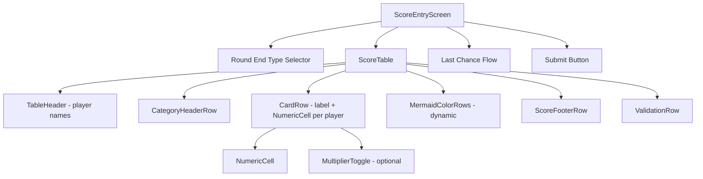
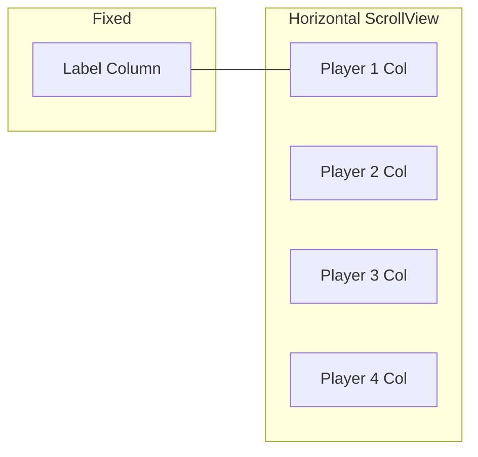

# Design Document: Table Score Entry

## Overview

This feature replaces the current collapsible/expander-based score entry UI in `app/score-entry.tsx` with a table layout. The table renders card type labels in a sticky left column and one column per player for numeric inputs and multiplier toggles. This is a UI-only refactor — no changes to types, scoring engine, game store, or persistence.

The current UI stacks per-player cards vertically, each with collapsible sections for Duo Cards, Collector Cards, and Mermaids. The new table layout shows all card types × all players simultaneously, reducing tap count and improving at-a-glance comparison.

### Key Design Decisions

1. **Single-file refactor**: All changes are confined to `app/score-entry.tsx`. The `ScoreEntryScreen` component, its state management, submission logic, and Last Chance flow remain structurally identical — only the breakdown entry UI changes from per-player collapsible cards to a shared table.
2. **No new dependencies**: The table is built with React Native's `View`, `ScrollView`, and `StyleSheet`. No third-party table or grid library is introduced.
3. **Horizontal scroll with sticky column**: A nested `ScrollView` (horizontal) wraps the player columns while the label column is rendered outside the scroll area using absolute positioning / a parallel fixed `View`, achieving the sticky effect without native sticky-header support.

## Architecture

The component hierarchy changes from:

```
ScoreEntryScreen
  └─ PlayerBreakdownForm (per player)
       ├─ CollapsibleSection "Duo Cards"
       ├─ CollapsibleSection "Collector Cards"
       └─ CollapsibleSection "Mermaids"
```

To:

```
ScoreEntryScreen
  └─ ScoreTable
       ├─ TableHeader (player names)
       ├─ CategoryHeaderRow "Duo Cards"
       ├─ CardRow "Crabs"          (NumericCell per player)
       ├─ CardRow "Boats"          (NumericCell + MultiplierToggle per player)
       ├─ CardRow "Fish"           (NumericCell + MultiplierToggle per player)
       ├─ CardRow "Swimmer+Shark"  (NumericCell per player)
       ├─ CategoryHeaderRow "Collector Cards"
       ├─ CardRow "Shells"         (NumericCell per player)
       ├─ CardRow "Octopus"        (NumericCell per player)
       ├─ CardRow "Penguins"       (NumericCell + MultiplierToggle per player)
       ├─ CardRow "Sailors"        (NumericCell + MultiplierToggle per player)
       ├─ CategoryHeaderRow "Mermaids"
       ├─ CardRow "Mermaid Count"  (NumericCell per player)
       ├─ MermaidColorRows         (dynamic, per player's mermaid count)
       ├─ ScoreFooterRow           (computed score per player)
       └─ ValidationRow            (errors per player, if any)
```



### Horizontal Scroll Strategy



The outer container uses `flexDirection: 'row'`. The label column has a fixed width and is not inside the horizontal `ScrollView`. The player columns sit inside a horizontal `ScrollView`. On 2-3 player games the table likely fits without scrolling; on 4-player games on narrow screens, the user scrolls horizontally while labels stay pinned.

## Components and Interfaces

### ScoreTable

The main new component. Receives the full breakdowns array, player list, card scores, validation errors, and change handlers from `ScoreEntryScreen`.

```typescript
interface ScoreTableProps {
    players: Player[];
    breakdowns: CardBreakdown[];
    cardScores: number[];
    validationErrors: string[][];
    onBreakdownChange: (playerIndex: number, breakdown: CardBreakdown) => void;
    onMermaidInstantWin: (playerIndex: number) => void;
    submitAttempted: boolean;
}
```

### NumericCell

A compact numeric input for a single player × card type intersection.

```typescript
interface NumericCellProps {
    value: number;
    onChange: (value: number) => void;
    accessibilityLabel: string;
}
```

### MultiplierToggle

A small inline toggle rendered inside or adjacent to a `NumericCell` for boats, fish, penguins, and sailors rows.

```typescript
interface MultiplierToggleProps {
    active: boolean;
    onToggle: (value: boolean) => void;
    label: string;
    accessibilityLabel: string;
}
```

### CardRow

Renders one row: a label cell + one `NumericCell` (and optionally a `MultiplierToggle`) per player.

```typescript
interface CardRowProps {
    label: string;
    players: Player[];
    values: number[];
    onValueChange: (playerIndex: number, value: number) => void;
    multiplier?: {
        actives: boolean[];
        onToggle: (playerIndex: number, value: boolean) => void;
        label: string;
    };
}
```

### CategoryHeaderRow

A full-width row displaying a category name (e.g., "🦀 Duo Cards").

```typescript
interface CategoryHeaderRowProps {
    title: string;
}
```

### ScoreFooterRow

Displays computed card scores per player at the bottom of the table.

```typescript
interface ScoreFooterRowProps {
    players: Player[];
    scores: number[];
}
```

### Removed Components

- `CollapsibleSection` — no longer needed
- `NumericField` — replaced by `NumericCell` (table-oriented)
- `NumericFieldWithMultiplier` — replaced by `NumericCell` + `MultiplierToggle`
- `PlayerBreakdownForm` — replaced by `ScoreTable`

The standalone `NumericField` component is still used in the Last Chance color bonus step (not part of the table), so a simplified version is retained for that purpose.

## Data Models

No data model changes. The feature reuses all existing types from `src/types.ts`:

- `CardBreakdown` — the per-player breakdown state (duo, collector, multiplier, mermaids)
- `PlayerCardBreakdown` — wraps `CardBreakdown` with `playerIndex`
- `MultiplierCards` — boolean flags for boat, fish, penguin, sailor
- `MermaidEntry` — `{ colorCount: number }`
- `Player` — `{ name: string, seatIndex: number }`

State shape in `ScoreEntryScreen` is unchanged:

- `breakdowns: CardBreakdown[]` — indexed by player index
- `validationErrors: string[][]` — indexed by player index
- `cardScores: number[]` — derived via `useMemo` from breakdowns

The table component reads from and writes to these same arrays; it just presents them in a transposed layout (rows = card types, columns = players) instead of the current layout (sections = players, rows = card types).

## Correctness Properties

_A property is a characteristic or behavior that should hold true across all valid executions of a system — essentially, a formal statement about what the system should do. Properties serve as the bridge between human-readable specifications and machine-verifiable correctness guarantees._

### Property 1: Column count matches player count

_For any_ game session with N players (where N is 2, 3, or 4), the ScoreTable should render exactly 1 label column and N player columns.

**Validates: Requirements 1.1, 1.5**

### Property 2: Player names appear in column headers

_For any_ set of player names, each player's name should appear exactly once in the table header row, in the order matching their player index.

**Validates: Requirements 1.2**

### Property 3: All numeric cells have numeric keyboard and "0" placeholder

_For any_ numeric input cell in the ScoreTable, the cell should have `keyboardType` set to `"numeric"` and `placeholder` set to `"0"`.

**Validates: Requirements 2.1, 2.2**

### Property 4: Numeric input updates the correct breakdown field

_For any_ player index, card type field, and non-negative integer value, entering that value in the corresponding cell should update exactly that field in the player's `CardBreakdown` and leave all other players' breakdowns unchanged.

**Validates: Requirements 2.3**

### Property 5: Non-numeric and empty input normalizes to zero

_For any_ string that is empty or does not parse to a valid integer, the `parseIntSafe` function should return 0.

**Validates: Requirements 2.4**

### Property 6: Multiplier toggle round-trip

_For any_ player index and multiplier type (boat, fish, penguin, sailor), toggling the multiplier on should set the corresponding `MultiplierCards` field to `true`, and toggling it off should set it back to `false`, with no side effects on other fields.

**Validates: Requirements 3.2, 3.3**

### Property 7: Mermaid color rows match per-player mermaid count

_For any_ combination of mermaid counts across all players (each 0–4), each player's rendered mermaid color row count should equal that player's mermaid count, independent of other players' counts.

**Validates: Requirements 4.1, 4.2**

### Property 8: Decreasing mermaid count truncates from the bottom

_For any_ player with an initial mermaid count M and a decreased count M' (where 0 ≤ M' < M ≤ 4), the resulting mermaids array should equal the first M' entries of the original array, preserving existing color count values.

**Validates: Requirements 4.4**

### Property 9: Footer score equals calculateCardScore

_For any_ valid `CardBreakdown`, the score displayed in the `ScoreFooterRow` for that player should equal the value returned by `calculateCardScore(breakdown)`.

**Validates: Requirements 5.1, 5.2**

### Property 10: Invalid breakdowns produce validation errors on submit

_For any_ `CardBreakdown` that fails `validateCardBreakdown`, after a submission attempt, the validation errors for that player should be non-empty and match the errors returned by `validateCardBreakdown`.

**Validates: Requirements 6.1**

## Error Handling

| Scenario                                            | Handling                                                                                               |
| --------------------------------------------------- | ------------------------------------------------------------------------------------------------------ |
| Empty or non-numeric input in a cell                | `parseIntSafe` normalizes to `0` on blur; breakdown state always holds valid integers                  |
| Collector card count exceeds max (e.g., shells > 6) | `validateCardBreakdown` catches this on submit; errors displayed per-player in the validation row      |
| Mermaid count > 4 entered                           | Clamped to 4 in `updateMermaidCount` before updating state                                             |
| Mermaid count = 4                                   | Triggers instant win confirmation dialog; if dismissed, count remains at 4                             |
| No game session                                     | `ScoreEntryScreen` redirects to home (`/`) via `router.replace`                                        |
| Submit with validation errors                       | Submission blocked; `submitAttempted` flag set to `true` to enable live validation on subsequent edits |

All error handling reuses existing logic from the current `score-entry.tsx`. No new error paths are introduced.

## Testing Strategy

### Unit Tests

Unit tests cover specific examples and edge cases:

- Table renders correct row order (Crabs, Boats, Fish, Swimmer+Shark, Shells, Octopus, Penguins, Sailors, Mermaid Count) — validates Requirement 1.3
- Category headers ("Duo Cards", "Collector Cards", "Mermaids") appear in correct positions — validates Requirement 1.4
- Multiplier toggles appear only on Boats, Fish, Penguins, and Sailors rows — validates Requirement 3.1
- Mermaid count of 4 triggers instant win prompt — validates Requirement 4.3
- Round End Type selector renders all three options (Stop, Last Chance, Empty Deck) — validates Requirement 8.4

### Property-Based Tests

Property-based tests use `fast-check` (already in devDependencies) with a minimum of 100 iterations per property.

Each property test must be tagged with a comment in the format:
**Feature: table-score-entry, Property {number}: {property_text}**

Properties to implement:

1. **Property 1**: Generate random player counts (2–4), verify column count = 1 + N
2. **Property 2**: Generate random player name arrays, verify all names appear in header
3. **Property 3**: Render table, query all numeric inputs, verify keyboardType and placeholder attributes
4. **Property 4**: Generate random (playerIndex, fieldName, value) triples, apply change, verify only the target field updated
5. **Property 5**: Generate arbitrary strings (empty, whitespace, alpha, symbols, valid numbers), verify parseIntSafe returns 0 for non-numeric and the correct integer for valid numbers
6. **Property 6**: Generate random (playerIndex, multiplierType, boolean) triples, apply toggle, verify field matches and other fields unchanged
7. **Property 7**: Generate random mermaid count arrays (one per player, each 0–4), verify rendered color row counts match
8. **Property 8**: Generate random initial mermaid arrays (1–4 entries with random colorCounts), then a smaller target count, verify truncation preserves first N entries
9. **Property 9**: Generate random valid CardBreakdowns, verify displayed score equals `calculateCardScore(breakdown)`
10. **Property 10**: Generate random invalid CardBreakdowns (e.g., shells=7, negative counts), verify validation errors match `validateCardBreakdown` output

Properties 4–6 and 8 test pure state transformation logic and can run without rendering.
Properties 5 and 9 test pure functions (`parseIntSafe`, `calculateCardScore`) and are the simplest to implement.
Properties 1–3, 7, and 10 require rendering the component (React Native Testing Library or equivalent).

Each correctness property is implemented by a single property-based test. Unit tests complement these by covering the fixed-structure examples and edge cases listed above.
